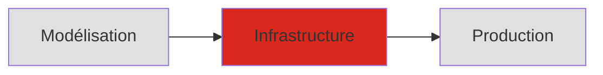

  
  

    <h1 class="cover-title">01 — Introduction</h1>
    
Infrastructure de données

    

      Noemi Romano
      <a href="mailto:noemi.romano@heig-vd.ch" class="cover-email">noemi.romano@heig-vd.ch</a>
      {{ new Date().toLocaleDateString('fr-CH') }}
    

  

---
layout: section
---

# D'où venez-vous ?

---
layout: default
---

# Rappel : le cours de modélisation

Le cours de **Modélisation de données** vous a appris à :

<v-clicks>

- Concevoir un **MCD** (Modèle Conceptuel de Données)
- Le transformer en **MLD** (Modèle Logique)
- L'implémenter en **MPD** (Modèle Physique)
- Écrire des requêtes **SQL**

</v-clicks>

**Question** : Une fois vos tables créées... que se passe-t-il quand 1000 utilisateurs y accèdent simultanément ?

---
layout: default
---

# Ce cours : la suite logique

<v-clicks>

- **Modélisation** — _Quoi_ stocker

- **Infrastructure** — _Comment_ le stocker, le protéger, le faire évoluer

- **Production** — Systèmes réels avec vrais utilisateurs

</v-clicks>

---
layout: default
---

# Zoom arrière : la base de données est un composant

<v-clicks>

- La base de données est **essentielle** mais **pas suffisante**
- Elle coexiste avec des caches, des files d'attente, du stockage objet, des moteurs de recherche
- Chaque composant a ses forces : le bon outil pour le bon usage
- Ce cours se concentre sur la **couche données** — mais en gardant la vue d'ensemble

</v-clicks>

<figcaption><a href="https://www.softkraft.co/web-application-architecture/">Softkraft — Web Application Architecture</a></figcaption>

---
layout: section
---

# Les 10 modules du semestre

---
layout: default
---

# Les 10 modules en un coup d'oeil

| Module | Mots-clés |
|---|---|
| 02 · Fondamentaux | CRUD, ACID, OLTP/OLAP, vues |
| 03 · Import et nettoyage | Staging, qualité, nettoyage SQL |
| 04 · Transactions | Isolation, verrous, deadlocks |
| 05 · Optimisation | Plans d'exécution, index |
| 06 · Sécurité et sauvegarde | Rôles, permissions, backup |
| 07 · Structures de données | NoSQL, graph, stockage médias |
| 08 · Flux de données | ETL/ELT, CDC, dbt |
| 09 · Architectures modernes | Data mesh, medallion, RAG |
| 10 · Éthique et durabilité | Environnement, souveraineté |

---
layout: default
---

# Penser l'infrastructure : technique, valeurs et impacts

Tout au long du semestre, nous questionnerons nos décisions techniques :

| Décision | Question |
|---|---|
| **Cloud vs on-premise** | Juridiction ? Souveraineté des données ? |
| **Propriétaire vs open source** | Vendor lock-in ? |
| **Dimensionnement** | Coût énergétique vs coût humain |
| **Rétention** | Que garde-t-on, combien de temps ? |
| **Redondance et backups** | Coût acceptable d'une perte ? |
| **Choix de structure** | Relationnel, NoSQL, graph — quel usage ? |

Il n'y a pas de choix neutre. Une infrastructure bien conçue est une infrastructure dont les compromis sont **documentés et assumés**.

<a href="https://www.edoeb.admin.ch/fr/protection-des-donnees">nLPD</a> · <a href="https://stm.cairn.info/revue-enjeux-numeriques-2025-1-page-8?lang=fr">Enjeux et perspectives pour une IA éthique et durable, <em>Annales des Mines</em> n°29, 2025</a>

---
layout: section
---

# Organisation du cours

---
layout: default
---

# Organisation du semestre

### 12 semaines

| Sem. | Module |
|---|---|
| 1 | Introduction |
| 2 | Fondamentaux |
| 3 | Import et nettoyage |
| 4 | Transactions |
| 5 | Optimisation |
| 6 | Sécurité et sauvegarde |
| 7 | Structures de données |
| 8 | Flux de données |
| 9 | Architectures modernes |
| 10 | Éthique et durabilité |
| 11-12 | Projet (finalisation + poster) |

### Évaluation

**Projet (50%)**
Par groupes de 2 — plus de détails au slide suivant

**Examen (50%)**
Sur ordinateur · 3h · Session d'examen

---
layout: default
---

# Outils et prérequis

### Ce que vous connaissez déjà

<v-clicks>

- **PostgreSQL** + **PostGIS** — Notre SGBD principal
- **Git / GitHub** — Versioning du projet
- **Docker** — Conteneurisation

</v-clicks>

### Ce que nous ajouterons

- **EXPLAIN ANALYZE** — Analyse de requêtes
- **pg_dump / pg_restore** — Sauvegarde
- **dbt** — Transformation de données

---
layout: section
---

# Le projet fil rouge

Service technique communal d'Yverdon-les-Bains

---
layout: default
---

# Le contexte

La personne en charge du Service technique de la Commune d'Yverdon-les-Bains gère depuis 2018 le **mobilier urbain** dans des fichiers Excel : bancs, lampadaires, fontaines, poubelles, bornes de recharge.

<v-clicks>

- Elle note les **signalements** de la population (un banc cassé, un lampadaire éteint)
- Elle enregistre les **interventions** de maintenance
- Elle tient une liste de **fournisseurs** pour commander du matériel

</v-clicks>

Vous recevez les **4 fichiers Excel** tels quels. Votre mission : en faire une **infrastructure de données** fonctionnelle, optimisée, et utile.

Les données sont **fictives** — les noms, numéros et coordonnées ont été générés pour les besoins du cours.

---
layout: default
---

# Les données du Service technique

### inventaire_mobilier.xlsx

~120 objets : bancs, lampadaires, fontaines, poubelles, bornes EV

Positions GPS dans la commune d'Yverdon

### signalements.xlsx

~200 signalements de la population et de patrouilles

Dates, descriptions en texte libre, urgence, statut

### interventions.xlsx

~150 interventions de maintenance

Dates, technicien-ne-s, durée, coûts, type d'intervention

### fournisseurs_contacts.xlsx

~15 fournisseurs régionaux

Contacts, spécialités

Les données sont volontairement **imparfaites** : casse variable, formats de date qui évoluent, références par texte libre, champs parfois vides. Comme de vrais Excel faits à la main.

---
layout: default
---

# Un brief par groupe

Chaque groupe reçoit les **mêmes données** mais un **brief différent** :

### A — Rapport au Conseil communal

Coût d'entretien par type de mobilier, top 5 des objets les plus coûteux, saisonnalité des interventions.

### B — Plainte du quartier de la Gare

Délai moyen signalement → intervention par quartier, signalements ouverts > 30 jours, taux de résolution.

### C — Remplacement des lampadaires

Fiche par lampadaire, score de priorité (pannes × âge × coût), sélection dans un budget de CHF 50'000.-.

### D — Renouvellement des bancs

État du parc bois vs métal, bancs à remplacer sous 2 ans, estimation budgétaire et recommandation matériau.

---
layout: default
---

# Évaluation

| Composante | Poids |
|---|---|
| **Projet** — présentation + poster A3 | 50% |
| **Examen final** — semaine d'examen | 50% |

### Projet (50%)

- **Poster A3** synthétisant les étapes du projet (affiché en classe)
- Présentation du poster + questions (28-29 mai)
- Rendu final : scripts, jalons, adaptations (31 mai)

### Examen final (50%)

- Individuel, en semaine d'examen
- Mise en situation : un schéma, un cas, un problème — proposer et justifier une solution

---
layout: default
---

# Jalons du projet (formatifs, non notés)

Chaque jalon vous fait progresser — le feedback en classe ne compte pas dans la note.

| Jalon | Sem. | Livrable |
|---|---|---|
| **J0** Modélisation | 1-2 | MCD, MLD, qualité |
| **J1** Import | 3-4 | MPD, staging, nettoyage |
| **J2** Requêtes | 5-6 | Requêtes métier, index |
| **J3** Sécurité | 7-8 | Rôles, permissions |
| **J4** dbt + poster | 9-10 | Staging → marts, poster A3 |
| **J5** Présentation + poster | 28-29 mai | Poster A3 affiché + présentation |
| **Rendu final** | 31 mai | Scripts, jalons, adaptations |

**Groupes de 2-3 personnes** — Formation des groupes et tirage du brief aujourd'hui

---
layout: section
---

# Activité : premiers pas

---
layout: default
---

# Activité en classe (30 min)

### Étape 1 — Formation des groupes

<v-clicks>

1. **Former les groupes** (2-3 personnes)
2. **Tirer au sort** votre brief (A, B, C ou D)
3. **Ouvrir les 4 fichiers Excel** et les explorer

</v-clicks>

### Étape 2 — Premières observations

En groupe, notez :

- Quels **problèmes de qualité** voyez-vous dans les données ?
- Quelles **colonnes** vous semblent utiles pour votre brief ?
- Quelles **relations** existent entre les fichiers ?
- Qu'est-ce qui **manque** pour répondre à votre brief ?

Il n'y a pas de bonne réponse aujourd'hui. L'objectif est d'observer les données telles qu'elles sont, avant de les transformer.

---
layout: default
---

# Pour la semaine prochaine

### À faire

- **Créer un repo GitHub** de groupe
- **Lancer le `docker-compose`** fourni (PostgreSQL + PostGIS)
- **Explorer les 4 fichiers Excel** et noter les problèmes de qualité
- **Commencer le MCD** : quelles entités ? quelles relations ?

### À lire (optionnel mais recommandé)

- [Data Feminism, Introduction](https://data-feminism.mitpress.mit.edu/pub/frfa9szd)
- [PostgreSQL ACID](https://www.postgresql.org/docs/current/transaction-iso.html)

**Prochain cours** : Module 02 — Fondamentaux des bases de données

_CRUD, ACID, OLTP vs OLAP, vues et vues matérialisées_

---
layout: default
---

# Ressources du cours

### Livres

- **Data Feminism** — D'Ignazio & Klein (2020)
   <small>[data-feminism.mitpress.mit.edu](https://data-feminism.mitpress.mit.edu/)</small>

- **Designing Data-Intensive Applications** — Kleppmann (2017)
   <small>O'Reilly Media</small>

- **Atlas of AI** — Crawford (2021)
   <small>Yale University Press</small>

### En ligne

- [PostgreSQL Documentation](https://www.postgresql.org/docs/)
- [Use The Index, Luke!](https://use-the-index-luke.com/)
- [dbt Documentation](https://docs.getdbt.com/)
- [FAIR Principles](https://www.go-fair.org/fair-principles/)
- [IA éthique et durable — Cairn](https://stm.cairn.info/revue-enjeux-numeriques-2025-1-page-8?lang=fr)

---
layout: end
---

# Questions ?
