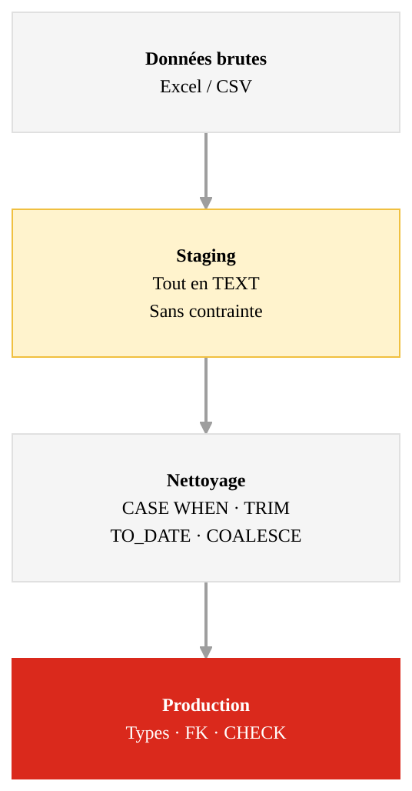

<div class="cover-custom">
  
  <div class="cover-content">
    <h1 class="cover-title">03 - Import et nettoyage des données</h1>
    <p class="cover-subtitle">Infrastructure de données</p>
    <div style="display: flex; align-items: center; gap: 0.75rem; margin-top: 0.5rem;">
      <a target="_blank" href="https://github.com/MediaComem/comem-infradon" class="cover-email" style="display: flex; align-items: center; gap: 0.25rem;"><carbon-logo-github /> GitHub</a>
      <a target="_blank" href="https://creativecommons.org/licenses/by/4.0/"></a>
    </div>
    <div class="cover-meta">
      <span class="cover-author">Noemi Romano</span>
      <a href="mailto:noemi.romano@heig-vd.ch" class="cover-email">noemi.romano@heig-vd.ch</a>
      <span class="cover-date">{{ new Date().toLocaleDateString('fr-CH') }}</span>
    </div>
  </div>
</div>

---
layout: section
---

# Pourquoi les données sont-elles incohérentes ?


---
layout: default
---

# Sources d'incohérences

<div class="grid grid-cols-2 gap-8 mt-6">

<div>


Les données saisies par des humains, dans des outils sans contraintes, sur de longues périodes, accumulent inévitablement des incohérences.

Ce n'est pas un problème de mauvaise volonté : c'est l'**absence de contraintes à l'entrée** qui rend les incohérences structurelles.


</div>

<div>

<div class="flex flex-col gap-3 mt-2" style="font-size: 0.82rem;">

<div class="px-3 py-2 border-l-2 border-gray-400"><b>Saisie humaine libre</b> : sans contrainte, chaque personne invente ses conventions</div>

<div class="px-3 py-2 border-l-2 border-gray-400"><b>Évolution dans le temps</b> : les pratiques changent, les vieilles données restent</div>

<div class="px-3 py-2 border-l-2 border-gray-400"><b>Plusieurs contributeurs</b> : chacun a ses habitudes, personne ne synchronise</div>

<div class="px-3 py-2 border-l-2 border-gray-400"><b>Outil inadapté</b> : Excel n'impose aucun type, aucune contrainte, aucun format</div>

<div class="px-3 py-2 border-l-2 border-gray-400"><b>Urgence</b> : on saisit vite, on corrigera plus tard (spoiler : on ne corrige pas)</div>

</div>

</div>

</div>

---
layout: default
---

# Inventaire des incohérences : notre projet

<div class="text-sm text-gray-500 italic mb-2">Extrait des 4 fichiers Excel du Service technique d'Yverdon</div>

<div class="table-compact" style="font-size: 0.62rem;">

| Problème | Colonne | Exemples |
|---|---|---|
| Formats de date multiples | `date`, `date_installation` | `12.03.2022` · `2022-03-12` · `mars 2022` · `2022` |
| Casse et orthographe | `type` | `banc` · `Banc` · `banc public` |
| Matériaux incohérents | `materiau` | `métal` · `metal` · `Métal` |
| IDs incohérents | `id` | `B-001` (avant 2020) · `B_1` (2021) · `1001` (2022+) |
| Texte libre pour les personnes | `technicien` | `Jean-Marc` · `JM` · `Jean-Marc Bonvin` |
| Coûts non structurés | `cout_materiel` | `120` · `CHF 120.-` · `gratuit` · `(vide)` |
| Durées non structurées | `duree` | `1h` · `1h30` · `30 min` · `une matinée` |
| GPS manquants ou imprécis | `latitude`, `longitude` | `NULL` (~8%) · `46.78` (2 décimales seulement) |
| Doublons partiels | - | même banc entré 2x avec ID légèrement différent |
| Liens par texte libre | `objet` | `le banc devant Place Pestalozzi` (pas d'ID) |
| Contacts incohérents | `telephone` | `024 423 12 34` · `0791234567` · `+41 21 456 78 90` |

</div>

<div class="accent-box mt-3" style="font-size: 0.82rem;">

Chacun de ces problèmes nécessite une **décision** : normaliser, imputer, exclure ou documenter. Il n'y a pas de réponse automatique.

</div>


---
layout: section
---

# Modéliser avant d'importer


---
layout: default
---

# La stratégie en 4 phases

<div class="grid grid-cols-2 gap-8 mt-4">

<div>


**Importer d'abord, modéliser après** : l'approche tentante.

- On charge les données dans des tables ad-hoc
- On essaie de faire des requêtes
- On se rend compte que les JOIN sont impossibles
- On recommence


<div class="accent-box mt-4">

**Modéliser d'abord** : définir la structure cible, puis construire le pipeline de nettoyage pour y arriver

</div>

</div>

<div>



</div>

</div>

---
layout: default
---

# Les décisions de modélisation

<div class="table-compact" style="font-size: 0.68rem;">

| Champ brut | Problème | Décision |
|---|---|---|
| `date` (texte) | 4 formats différents | `CASE WHEN` + `TO_DATE()` : `DATE` |
| `cout_materiel` | `"CHF 120.-"`, `"gratuit"`, `""` | `REGEXP_REPLACE` → chiffres · `"gratuit"` → `0` · `""` → `NULL` |
| `duree` | `"1h30"`, `"une matinée"`, `"30 min"` | Convertir en minutes (`INT`) · convention documentée |
| `type` | `"banc"`, `"Banc"`, `"banc public"` | `LOWER(TRIM(...))` + `CASE WHEN` : valeur normalisée |
| `technicien` | `"JM"`, `"Jean-Marc"`, `"Jean-Marc Bonvin"` | Table de correspondance : `technicien_id` (FK) |
| `latitude` | `NULL` ou `46.78` (2 décimales) | Conserver `NULL` · flaguer GPS imprécis |
| `objet` (texte libre) | Aucun lien formel avec un ID | Matching lieu + type : `mobilier_id` (best-effort) |

</div>

<div class="accent-box mt-3" style="font-size: 0.82rem;">

Documenter chaque décision. Quelqu'un d'autre relira votre pipeline dans 6 mois - et ce quelqu'un, c'est peut-être vous.

</div>

<div class="mt-4 flex items-center justify-center gap-2" style="font-size: 1rem;"><carbon-logo-github /> <a target="_blank" href="https://github.com/MediaComem/comem-infradon/blob/main/projet/aide-nettoyage.md">MediaComem/comem-infradon · projet/aide-nettoyage.md</a></div>

---
layout: section
---

# Import : la stratégie staging


---
layout: default
---

# La table de staging

<div class="grid grid-cols-2 gap-8 mt-4">

<div>


**Règle d'or** : lors d'un import brut, tout est `TEXT`.

- Aucune contrainte : pas d'erreur à l'import
- On voit exactement ce que la source contient
- On peut inspecter, compter, identifier les problèmes
- On transforme dans un second temps


</div>

<div>

```sql
-- Créer un schéma dédié pour la staging
CREATE SCHEMA IF NOT EXISTS staging;

-- Table de staging : miroir exact du CSV
-- Tout en TEXT, aucune contrainte
CREATE TABLE staging.inventaire (
  id                TEXT,
  type              TEXT,
  materiau          TEXT,
  lieu              TEXT,
  latitude          TEXT,
  longitude         TEXT,
  date_installation TEXT,
  etat              TEXT,
  remarques         TEXT
);
```

</div>

</div>

<div class="accent-box mt-4">

Une table de staging est sans FK, sans CHECK, sans NOT NULL. Son seul but : recevoir la donnée brute sans la rejeter.

</div>

<div class="footer"><a target="_blank" href="https://www.postgresql.org/docs/current/sql-createschema.html">PostgreSQL · CREATE SCHEMA</a> · <a target="_blank" href="https://www.postgresql.org/docs/current/sql-createtable.html">PostgreSQL · CREATE TABLE</a></div>

---
layout: default
---

# Table permanente ou temporaire ?

<div class="grid grid-cols-2 gap-8 mt-4">

<div>


PostgreSQL propose deux options :

**`CREATE TABLE staging.inventaire (...)`**
Table permanente dans un schéma dédié

**`CREATE TEMP TABLE inventaire (...)`**
Table temporaire, visible uniquement dans la session courante : supprimée à la déconnexion


</div>

<div class="table-compact">

| | Table permanente | Table temporaire |
|---|---|---|
| Survit à la déconnexion | ✓ | ✗ |
| Partageable avec l'enseignant·e | ✓ | ✗ |
| Itérations sur plusieurs séances | ✓ | ✗ |
| Nettoyage automatique | ✗ | ✓ |
| Usage recommandé | Projet, pipeline | Exploration rapide |

</div>

</div>

<div class="accent-box mt-4">

Pour ce projet : **table permanente** dans un schéma `staging`. La table temporaire est utile pour tester une transformation en une seule session, pas pour un pipeline qu'on construit sur plusieurs semaines.

</div>


---
layout: default
---

# Import : COPY via Docker

<div class="grid grid-cols-2 gap-8 mt-6">

<div>

Placer les fichiers CSV dans `data/` et vérifier que le volume est déclaré dans `docker-compose.yml` :

```yaml
volumes:
  - ./data:/data
```


</div>

<div>

```sql
COPY staging.inventaire_mobilier
FROM '/data/inventaire_mobilier.csv'
WITH (FORMAT csv, HEADER true,
      DELIMITER ',', ENCODING 'UTF8');
```

Le guide complet (export Excel, connexion, 4 fichiers) :

<div class="mt-2 flex items-center gap-2" style="font-size: 1rem;"><carbon-logo-github /> <a target="_blank" href="https://github.com/MediaComem/comem-infradon/blob/main/projet/aide-nettoyage.md">MediaComem/comem-infradon · projet/aide-nettoyage.md</a></div>

</div>

</div>

<div class="footer"><a target="_blank" href="https://www.postgresql.org/docs/current/sql-copy.html">PostgreSQL · COPY</a></div>

---
layout: section
---

# Nettoyage SQL


---
layout: default
---

# CASE WHEN : le if/switch de SQL

<div class="grid grid-cols-2 gap-4 mt-3" style="font-size: 0.7rem;">

<div>

**Forme 1 — valeur exacte** (comme `switch`) :

```sql {style="font-size:0.6rem; line-height:1.3;"}
CASE LOWER(TRIM(type))
    WHEN 'banc'           THEN 'banc'
    WHEN 'banc public'    THEN 'banc'
    WHEN 'lampadaire'     THEN 'lampadaire'
    WHEN 'lampadaire led' THEN 'lampadaire'
    ELSE NULL
END
```

En Java : `switch (t) { case "banc", "banc public" -> "banc"; ... }`

</div>

<div>

**Forme 2 — condition** (comme `if/else`) :

```sql {style="font-size:0.6rem; line-height:1.3;"}
CASE
    WHEN date LIKE '%.%.%'
        THEN TO_DATE(date, 'DD.MM.YYYY')
    WHEN date LIKE '____-__-__'
        THEN TO_DATE(date, 'YYYY-MM-DD')
    ELSE NULL
END
-- LIKE '%.%.%'    → contient des points (format CH)
-- LIKE '____-__-__' → format ISO (tirets)
```

En Java : `if (date.contains(".")) { ... } else if (...)`

</div>

</div>

<div class="accent-box mt-3" style="font-size: 0.72rem;">

`CASE WHEN` retourne une **valeur** : utilisable dans `SELECT`, `WHERE` ou `INSERT INTO ... SELECT`.

</div>

---
layout: default
---

# Fonctions SQL de nettoyage

<div class="grid grid-cols-2 gap-6 mt-4" style="font-size: 0.78rem;">

<div>

**Nettoyer les chaînes**

```sql
TRIM('  banc  ')        -- 'banc'
LOWER('Banc Public')    -- 'banc public'

-- Supprimer les espaces ET mettre en minuscule
LOWER(TRIM(type))
```

**Gérer les valeurs vides**

```sql
-- NULL si la chaîne est vide, sinon la valeur
NULLIF(TRIM(urgence), '')

-- Valeur par défaut si NULL
COALESCE(statut, 'en_attente')

-- Combiner : '' → NULL → 'en_attente'
COALESCE(NULLIF(TRIM(statut), ''), 'en_attente')
```

</div>

<div>

**Convertir les types**

```sql
-- Texte → date
TO_DATE('12.03.2022', 'DD.MM.YYYY')  -- 2022-03-12
TO_DATE('2022-03-12', 'YYYY-MM-DD')  -- 2022-03-12

-- Texte → nombre
'120'::NUMERIC
NULLIF(latitude,'')::NUMERIC(9,6)

-- Extraire uniquement les chiffres d'une chaîne
-- 'CHF 120.-' → '120'  (supprime tout sauf 0-9)
REGEXP_REPLACE(cout, '[^0-9]', '', 'g')::INT
```

**Filtrer avec LIKE**

```sql
-- LIKE teste si une chaîne ressemble à un motif
-- %  = n'importe quoi  |  _ = exactement 1 caractère
date LIKE '%.%.%'      -- contient des points
date LIKE '____-__-__' -- 4 chiffres, tiret, 2, tiret, 2
type LIKE 'banc%'      -- commence par "banc"
```

</div>

</div>

---
layout: default
---

# Dédoublonner avec ROW_NUMBER

<div class="grid grid-cols-2 gap-8 mt-4">

<div>


`ROW_NUMBER()` est une fonction de **fenêtrage** : attribue un numéro de ligne à chaque enregistrement. Combinée avec `PARTITION BY`, elle remet le compteur à 1 pour chaque groupe.


En Java, l'équivalent serait :

```java
// Grouper par (lieu, type)
Map<String, List<Row>> groupes = rows.stream()
    .collect(groupingBy(r ->
        r.lieu().toLowerCase() + "|" + r.type().toLowerCase()
    ));

// Garder seulement la première de chaque groupe
groupes.values().stream()
    .map(liste -> liste.get(0))
    .collect(toList());
```


</div>

<div>

**En SQL** :

```sql
WITH lignes_numerotees AS (
  SELECT *,
    ROW_NUMBER() OVER (
      PARTITION BY
        LOWER(TRIM(lieu)),
        LOWER(TRIM(type))
      ORDER BY id          -- garder la première occurrence
    ) AS numero
  FROM staging.inventaire
)
SELECT * FROM lignes_numerotees
WHERE numero = 1;          -- une seule ligne par groupe
```

<div class="accent-box mt-3">

`PARTITION BY` définit les groupes (comme `GROUP BY`), mais sans agréger les lignes : chaque ligne conserve toutes ses colonnes.

</div>

</div>

</div>

---
layout: default
---

# L'import direct sans staging

<div class="text-sm text-gray-500 italic mb-3">
<strong>Scénario</strong> : Vous importez <code>interventions.xlsx</code> directement dans la table <code>intervention</code> (avec ses types, contraintes et FK). Résultat : 47 erreurs sur 150 lignes. PostgreSQL refuse les lignes avec <code>cout_materiel = 'CHF 120.-'</code> (attendu : <code>NUMERIC</code>), <code>date = 'mars 2023'</code> (attendu : <code>DATE</code>), et <code>technicien = 'JM'</code> (pas de FK valide).
</div>

<div class="grid grid-cols-2 gap-2 mt-4" style="font-size: 0.72rem; line-height: 1.3;">

<div class="px-2 py-1 border-l-2 border-gray-400"><strong>Problème</strong><br/>Importer directement dans la table finale avec des contraintes actives (<code>NOT NULL</code>, <code>CHECK</code>, types stricts) rejette toute ligne non conforme - parfois la majorité des données.</div>

<div class="px-2 py-1 border-l-2 border-gray-400"><strong>Solution</strong><br/>Toujours passer par une <strong>table de staging</strong> sans contrainte. Nettoyer dans la staging, valider les résultats, puis insérer dans la table finale avec <code>INSERT INTO ... SELECT</code>.</div>

</div>

---
layout: section
---

# De la staging vers la production


---
layout: default
---

# INSERT INTO ... SELECT

<div class="grid grid-cols-2 gap-6 mt-3">

<div>

Une fois le nettoyage validé, on transfère en une seule requête.

```sql
INSERT INTO table_finale (col1, col2, ...)
SELECT
  transformation1 AS col1,
  transformation2 AS col2,
  ...
FROM staging.table_brute
WHERE condition_de_validite
ON CONFLICT (id) DO NOTHING;
-- ↑ idempotent : relancer sans risque de doublon
```

</div>

<div>

**Valider avant d'insérer :**

```sql {style="font-size:0.62rem; line-height:1.3;"}
-- Tous les types (→ vérifier le CASE WHEN)
SELECT type, COUNT(*)
FROM staging.inventaire
GROUP BY type ORDER BY COUNT(*) DESC;

-- Formats de date présents
SELECT date_installation, COUNT(*)
FROM staging.inventaire
GROUP BY date_installation
ORDER BY 2 DESC LIMIT 10;
```

<div class="mt-2" style="font-size: 0.75rem;">

Si 40% des types tombent dans `ELSE NULL`, le mapping `CASE WHEN` est incomplet.

</div>

</div>

</div>

<div class="grid grid-cols-2 gap-4 mt-3" style="font-size: 0.78rem;">

<div class="px-3 py-2 border-l-2 border-gray-400">

**Vues SQL** — encapsuler la logique de nettoyage → <a class="module-link" target="_blank" href="https://comem-infradon.onrender.com/05-optimisation-indexation/">module 05</a>

</div>

<div class="px-3 py-2 border-l-2 border-gray-400">

**dbt** — automatiser ce pipeline staging → marts → <a class="module-link" target="_blank" href="https://comem-infradon.onrender.com/08-flux-donnees-data-engineering/">module 08</a>

</div>

</div>

---
layout: section
---

# Activité


---
layout: default
---

# Activité : import et nettoyage

<div class="grid grid-cols-2 gap-8 mt-4">

<div>

### Jalon J0 — Exploration et modélisation
**Semaines 1-2**

**Étape 1 : Exploration**

Ouvrir `inventaire_mobilier.xlsx` et noter :
- Les formats de date présents
- Les variantes de `type` et `materiau`
- Les IDs suspects, les colonnes vides

**Étape 2 : Modélisation**

Identifier les entités, les relations et les cardinalités. Documenter les problèmes de qualité observés. Livrable : MCD et MLD.

</div>

<div>

### Jalon J1 — Import et nettoyage
**Semaines 3-4**

En vous appuyant sur `projet/aide-nettoyage.md` :

**Étape 3 : Staging**

Créer le schéma `staging`, les tables (tout en `TEXT`), importer les 4 fichiers CSV. Livrable : MPD (`CREATE TABLE`).

**Étape 4 : Nettoyage et production**

Nettoyage SQL (`CASE WHEN`, `TRIM`, `TO_DATE`, dédoublonnage), puis `INSERT INTO ... SELECT` vers les tables finales.

Vérifier : `SELECT COUNT(*) FROM mobilier;`

</div>

</div>

<div class="accent-box mt-4">

**Dates butoir** — J0 : fin semaine 2 · J1 : fin semaine 4 · J2 : fin semaine 6 · J3 : fin semaine 8 · J4 : fin semaine 10 · **Présentation : 28-29 mai · Rendu final : 31 mai**

</div>

---
layout: default
---

# Ressources du module

<div class="grid grid-cols-2 gap-4 mt-4" style="font-size: 0.8rem;">

<div>

### Documentation PostgreSQL

- [COPY](https://www.postgresql.org/docs/current/sql-copy.html)
- [CREATE SCHEMA](https://www.postgresql.org/docs/current/sql-createschema.html)
- [CREATE TABLE](https://www.postgresql.org/docs/current/sql-createtable.html)
- [Fonctions sur les chaînes (TRIM, REGEXP_REPLACE...)](https://www.postgresql.org/docs/current/functions-string.html)
- [Formatage (TO_DATE)](https://www.postgresql.org/docs/current/functions-formatting.html)
- [Window Functions (ROW_NUMBER)](https://www.postgresql.org/docs/current/tutorial-window.html)

</div>

<div>

### Projet

<div class="mt-2 flex items-center gap-2" style="font-size: 0.9rem;"><carbon-logo-github /> <a target="_blank" href="https://github.com/MediaComem/comem-infradon/blob/main/projet/aide-nettoyage.md">MediaComem/comem-infradon · projet/aide-nettoyage.md</a></div>

### Prochain module

[04 : Transactions et concurrence](https://comem-infradon.onrender.com/04-transactions-concurrence/)

</div>

</div>

---
layout: end
---

# Questions ?
