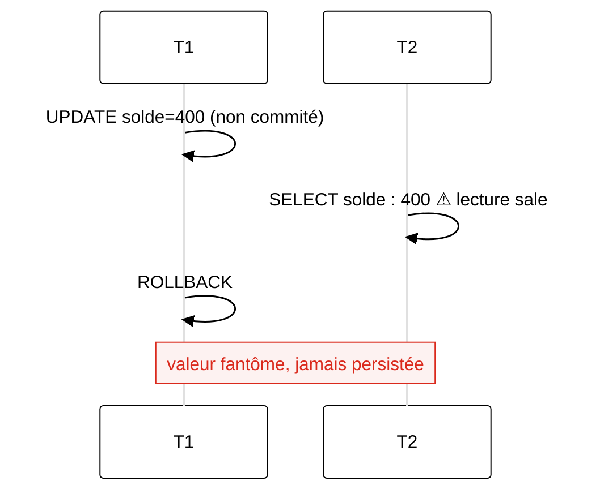
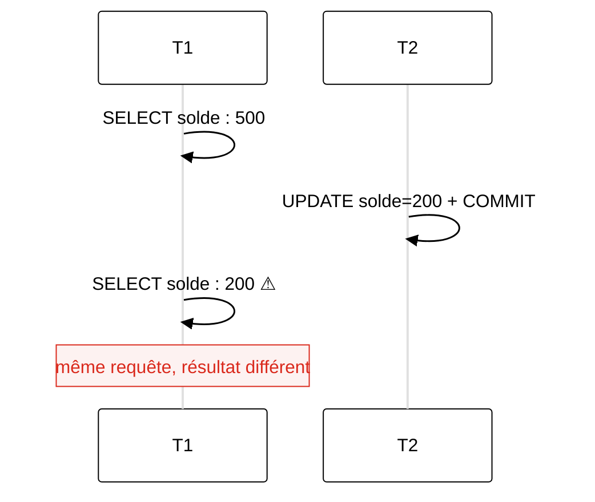
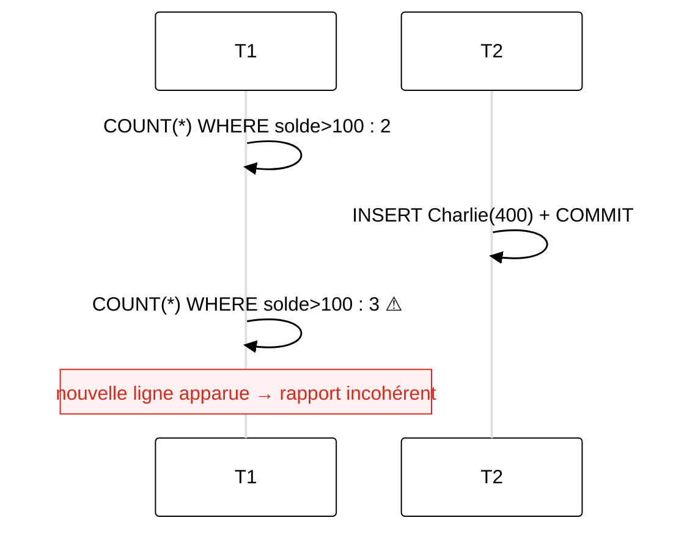
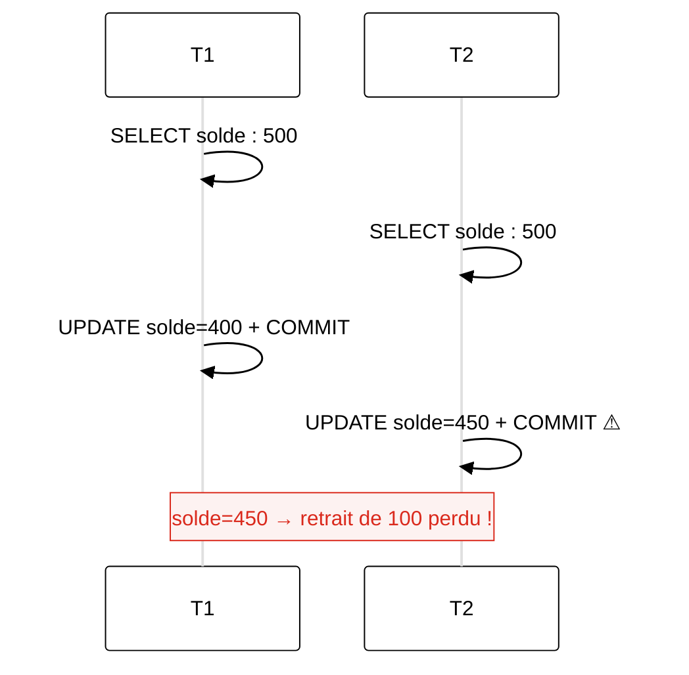
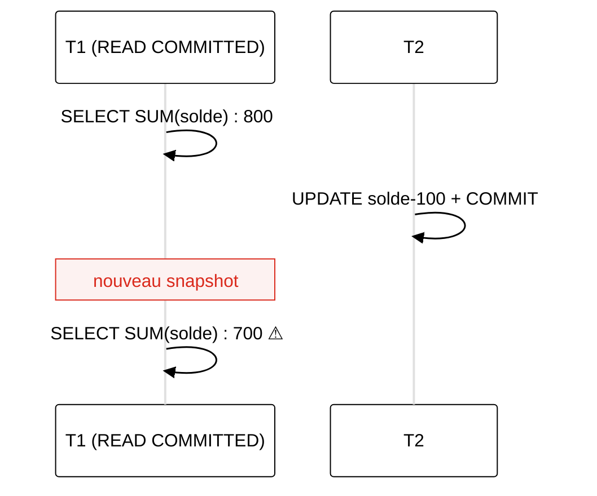
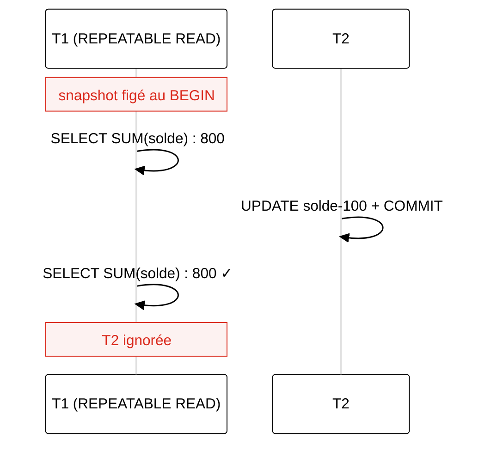
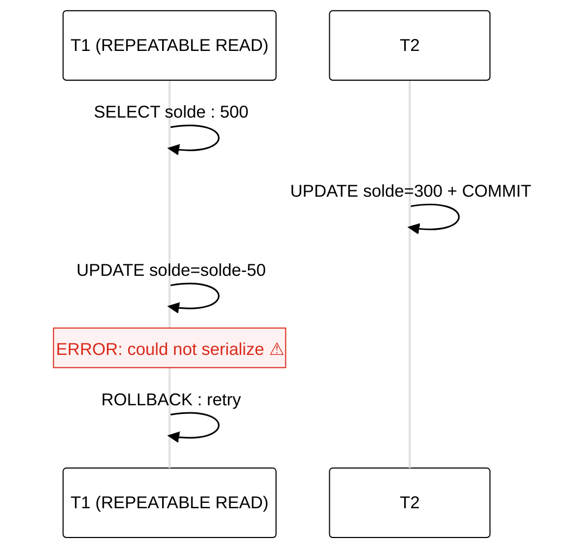
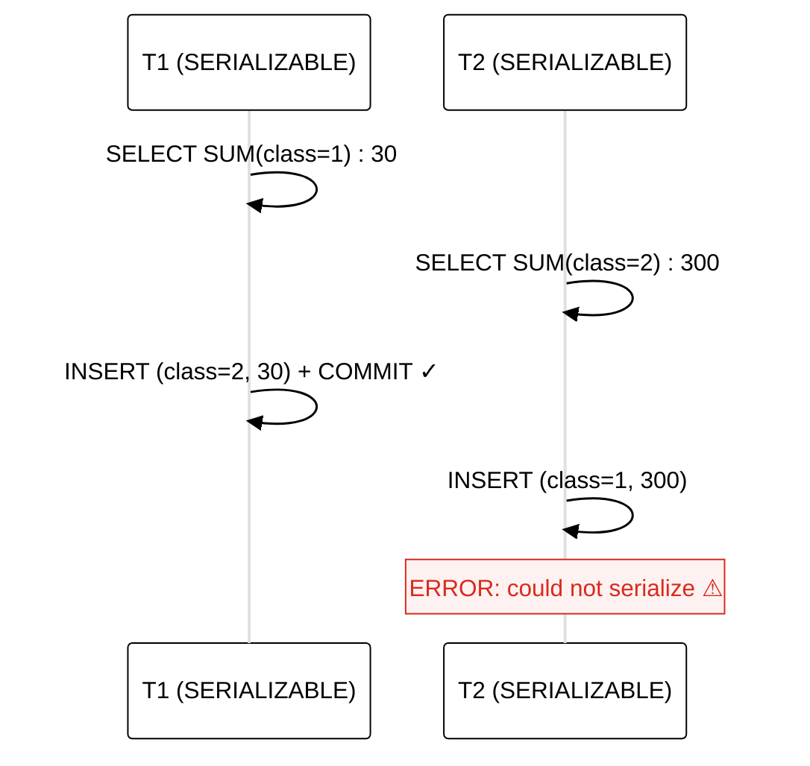
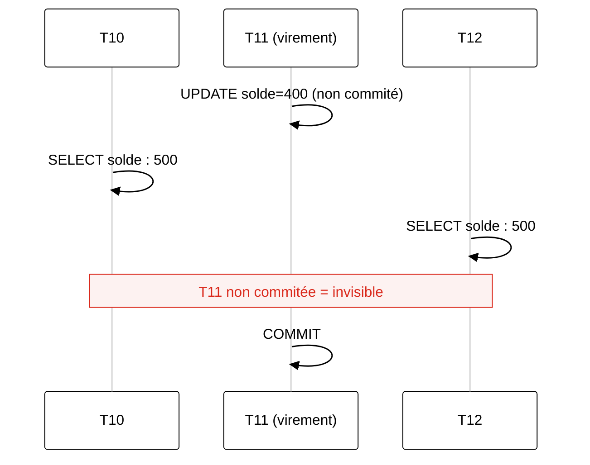
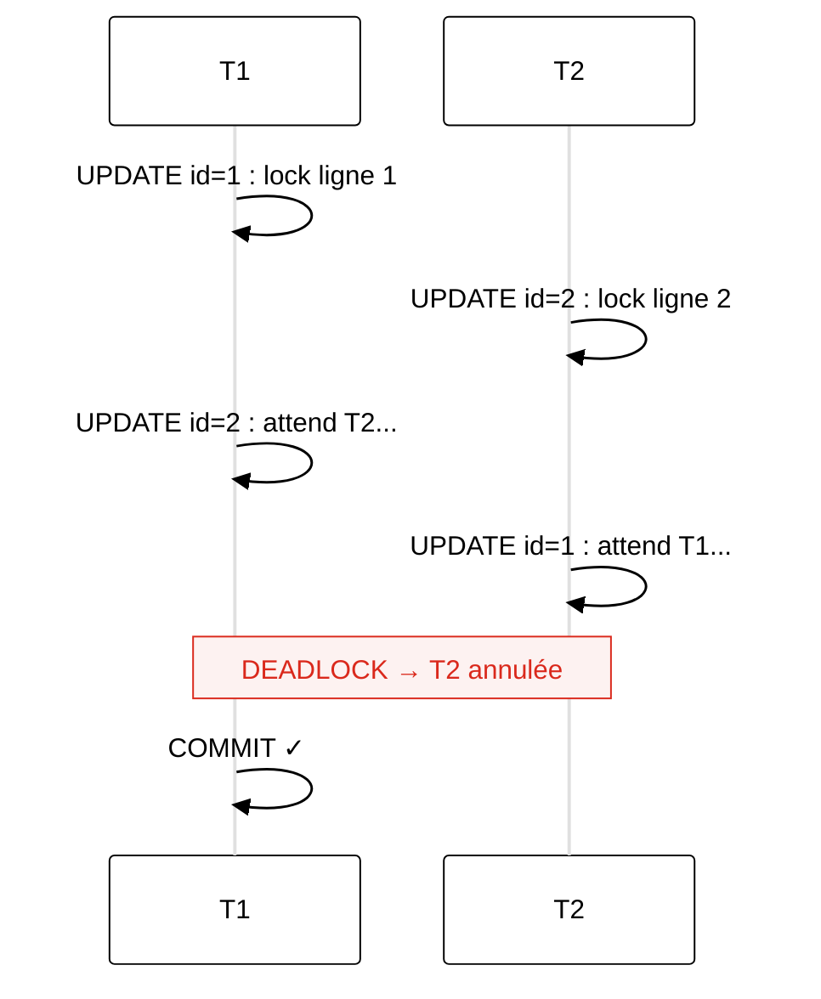

<div class="cover-custom">
  
  <div class="cover-content">
    <h1 class="cover-title">04 - Transactions et concurrence</h1>
    <p class="cover-subtitle">Infrastructure de données</p>
    <div style="display: flex; align-items: center; gap: 0.75rem; margin-top: 0.5rem;">
      <a target="_blank" href="https://github.com/MediaComem/comem-infradon" class="cover-email" style="display: flex; align-items: center; gap: 0.25rem;"><carbon-logo-github /> GitHub</a>
      <a target="_blank" href="https://creativecommons.org/licenses/by/4.0/"></a>
    </div>
    <div class="cover-meta">
      <span class="cover-author">Noemi Romano</span>
      <a href="mailto:noemi.romano@heig-vd.ch" class="cover-email">noemi.romano@heig-vd.ch</a>
      <span class="cover-date">{{ new Date().toLocaleDateString('fr-CH') }}</span>
    </div>
  </div>
</div>

---
layout: default
---

# Table de référence des exemples

<div class="grid grid-cols-2 gap-8 mt-6">

<div>

Tous les exemples qui suivent utilisent cette table.

```sql
CREATE TABLE compte (
  id        INT PRIMARY KEY,
  titulaire VARCHAR(50),
  solde     NUMERIC
);

INSERT INTO compte VALUES
  (1, 'Alice', 500),
  (2, 'Bob',   300);
```

</div>

<div>

### État initial

| id | titulaire | solde |
|----|-----------|------:|
| 1  | Alice     | 500   |
| 2  | Bob       | 300   |

*Même principe avec vos données Yverdon :*
*signalement, intervention, équipement…*

</div>

</div>

---
layout: section
---

# Rappel : transactions

<p class="section-subtitle"><a href="https://comem-infradon.onrender.com/02-fondamentaux" target="__blank" >Module 02 - Fondamentaux</a></p>

---
layout: default
---

# Qu'est-ce qu'une transaction ?

<div class="grid grid-cols-2 gap-8 mt-4">

<div>

Groupe d'opérations traitées comme une **unité indivisible**

- Toutes réussissent → **COMMIT**
- Au moins une échoue → **ROLLBACK**

**Sans `BEGIN` explicite** : chaque instruction = transaction implicite (autocommit)

**ACID** : Atomicité · Cohérence · Isolation · Durabilité
* → <a class="module-link" href="https://comem-infradon.onrender.com/02-fondamentaux/">Module 02 - Fondamentaux</a>

</div>

<div>


<div class="text-xs text-gray-400 mt-1">Source : <a href="https://www.javatpoint.com/dbms-transaction">javatpoint.com</a></div>

```sql
-- Scénario : virement bancaire
-- Les 2 opérations forment 1 seule unité

BEGIN;

UPDATE compte SET solde = solde - 100
WHERE id = 1;  -- débiter Alice

UPDATE compte SET solde = solde + 100
WHERE id = 2;  -- créditer Bob

COMMIT;  -- les deux ou aucune
```

</div>

</div>

<div class="footer"><a href="https://www.postgresql.org/docs/current/tutorial-transactions.html">PostgreSQL · Transactions</a></div>

---
layout: default
---

# Syntaxe

<div class="grid grid-cols-2 gap-8 mt-4">

<div>

### Contrôle de base

```sql
BEGIN;        -- démarrer

-- opérations...

COMMIT;       -- valider définitivement
-- ou
ROLLBACK;     -- annuler tout
```

**Si une instruction échoue** dans une transaction : PostgreSQL passe en état **aborted** → toutes les instructions suivantes sont ignorées jusqu'au `ROLLBACK`

</div>

<div>

### Points de sauvegarde

```sql
BEGIN;

UPDATE compte SET solde = solde - 100
WHERE id = 1;

SAVEPOINT avant_credit;

UPDATE compte SET solde = solde + 100
WHERE id = 2;
-- si erreur :
ROLLBACK TO SAVEPOINT avant_credit;
-- reprend ici sans tout annuler

UPDATE compte SET solde = solde + 100
WHERE id = 3;

COMMIT;
```

</div>

</div>

<div class="footer"><a href="https://www.postgresql.org/docs/current/sql-savepoint.html">PostgreSQL · SAVEPOINT</a></div>

---
layout: section
---

# Concurrence

<p class="section-subtitle">Que se passe-t-il quand deux transactions s'exécutent en même temps ?</p>


---
layout: default
---

# Le contexte : accès simultanés

<div style="font-size: 0.82rem; margin-bottom: 0.5rem;">

**Concurrence** : plusieurs transactions accèdent aux **mêmes données en même temps** : lectures et écritures entrelacées, sans coordination naturelle.

</div>

<div class="grid gap-4 mt-2" style="grid-template-columns: 1fr auto 1fr; align-items: stretch; font-size: 0.82rem;">

<div style="background: #f5f5f5; border: 1px solid #e0e0e0; border-radius: 6px; padding: 0.8rem 1rem;">

### En production
- Dizaines ou centaines de **connexions simultanées**
- Chaque connexion = **transaction indépendante**
- Alice lit `solde=500` pendant que Bob le modifie
- Deux agents clôturent le même signalement en même temps

</div>

<div style="display: flex; flex-direction: column; justify-content: center; align-items: center; gap: 0.3rem; color: #DA291C; font-size: 1.6rem; padding: 0 0.5rem;">
  <span style="font-size: 0.7rem; color: #666;">sans contrôle</span>
  <span>→</span>
</div>

<div style="background: #f5f5f5; border: 1px solid #e0e0e0; border-radius: 6px; padding: 0.8rem 1rem; width: 100%;">

### 4 anomalies classiques

- **Dirty read** : lit une valeur non commitée
- **Non-repeatable read** : même requête, résultat différent
- **Phantom read** : nouvelles lignes apparaissent
- **Lost update** : une modification est écrasée

</div>

</div>

---
layout: default
---

# Anomalie 1 : Dirty read (lecture sale)

<div class="grid grid-cols-2 gap-6 mt-2">

<div style="font-size: 0.82rem;">

### Définition

* T2 lit des données **modifiées mais pas encore commitées** par T1

* Si T1 fait `ROLLBACK`, T2 a lu une valeur qui n'a **jamais existé**

* PostgreSQL **ne permet jamais** les dirty reads (même en `READ UNCOMMITTED`)

</div>

<div>



</div>

</div>

<div class="footer"><a href="https://www.postgresql.org/docs/current/transaction-iso.html">PostgreSQL · Transaction Isolation</a></div>

---
layout: default
---

# Anomalie 2 :  Non-repeatable read

<div class="grid grid-cols-2 gap-6 mt-2">

<div style="font-size: 0.82rem;">

### Définition

* T1 lit une ligne, puis la **relit** dans la même transaction
→ valeur différente car T2 l'a **modifiée et commitée** entre-temps

* *Même requête, résultat différent*


* Évité par `REPEATABLE READ` et `SERIALIZABLE`

</div>

<div>



</div>

</div>

<div class="footer"><a href="https://www.postgresql.org/docs/current/transaction-iso.html">PostgreSQL · Transaction Isolation</a></div>

---
layout: default
---

# Anomalie 3 :  Phantom read (lecture fantôme)

<div class="grid grid-cols-2 gap-6 mt-2">

<div style="font-size: 0.82rem;">

### Définition

* T1 lit un **ensemble de lignes** selon un critère, puis relit
→ de nouvelles lignes **apparaissent** car T2 en a inséré

* Ce ne sont pas des lignes modifiées :  ce sont de nouvelles lignes

* Évité par `SERIALIZABLE` (et aussi `REPEATABLE READ` dans PostgreSQL, contrairement au standard SQL)

</div>

<div>



</div>

</div>

<div class="footer"><a href="https://www.postgresql.org/docs/current/transaction-iso.html">PostgreSQL · Transaction Isolation</a></div>

---
layout: default
---

# Anomalie 4 : Lost update (mise à jour perdue)

<div class="grid grid-cols-2 gap-6 mt-2">

<div style="font-size: 0.82rem;">

### Définition

* T1 et T2 lisent la même valeur, puis la modifient toutes les deux
→ la **dernière modification écrase** la première

*Ex : deux retraits simultanés sur le même compte*

* Évité par `REPEATABLE READ`, `SERIALIZABLE`, ou `SELECT FOR UPDATE`

</div>

<div>



</div>

</div>

<div class="footer"><a href="https://www.postgresql.org/docs/current/transaction-iso.html">PostgreSQL · Transaction Isolation</a></div>

---
layout: section
---

# Niveaux d'isolation

<p class="section-subtitle">Choisir le bon compromis entre cohérence et performance</p>

---
layout: default
---

# READ COMMITTED : comportement par défaut

<div class="grid grid-cols-2 gap-6 mt-2">

<div style="font-size: 0.82rem;">

### Principe

- Voit uniquement les données **commitées avant le début de chaque requête**
- Snapshot renouvelé **à chaque instruction** → Deux `SELECT` identiques dans la même transaction peuvent retourner des résultats différents

* Convient aux opérations simples : pas aux rapports multi-requêtes

```sql
-- Dirty read impossible : SELECT voit toujours
-- une valeur commitée, jamais une valeur en cours
BEGIN; -- READ COMMITTED par défaut
SELECT solde FROM compte WHERE id = 1; -- valeur commitée
COMMIT;
```

</div>

<div>



</div>

</div>

<div class="footer"><a href="https://www.postgresql.org/docs/current/transaction-iso.html#XACT-READ-COMMITTED">PostgreSQL · Read Committed</a></div>

---
layout: default
---

# REPEATABLE READ : snapshot stable

<div class="grid grid-cols-2 gap-6 mt-2">

<div style="font-size: 0.82rem;">

### Principe

- Snapshot pris **au début de la première instruction** de la transaction
- Toutes les lectures voient les données telles qu'elles étaient **à ce moment-là**
- Prévient dirty read, non-repeatable read **et phantom read** (PostgreSQL va plus loin que le standard SQL)

```sql
BEGIN TRANSACTION ISOLATION LEVEL REPEATABLE READ;
SELECT solde FROM compte WHERE id = 1;     -- 500
-- T2 modifie et commite entre-temps...
SELECT solde FROM compte WHERE id = 1;     -- toujours 500 ✓
SELECT COUNT(*) FROM compte WHERE solde > 100; -- toujours 2 ✓
COMMIT;
```

</div>

<div>



</div>

</div>

<div class="footer"><a href="https://www.postgresql.org/docs/current/transaction-iso.html#XACT-REPEATABLE-READ">PostgreSQL · Repeatable Read</a></div>

---
layout: default
---

# REPEATABLE READ : conflit en écriture

<div class="grid grid-cols-2 gap-6 mt-2">

<div style="font-size: 0.82rem;">

### Conflit d'écriture entre deux transactions

* PostgreSQL ne peut pas appliquer la modification sans violer la cohérence du snapshot → Il annule T1 avec une **erreur de sérialisation** → L'application doit **réessayer** (`retry`)

* Seules les transactions **écrivant** peuvent avoir cette erreur : les transactions en lecture seule ne sont jamais annulées

```sql
-- Lost update évité : PostgreSQL détecte le conflit
BEGIN TRANSACTION ISOLATION LEVEL REPEATABLE READ;
SELECT solde FROM compte WHERE id = 1; -- 500
-- T2 modifie entre-temps...
UPDATE compte SET solde = solde - 50 WHERE id = 1;
-- ERROR: could not serialize access → ROLLBACK + retry
```

</div>

<div>



</div>

</div>

<div class="footer"><a href="https://www.postgresql.org/docs/current/transaction-iso.html#XACT-REPEATABLE-READ">PostgreSQL · Repeatable Read</a></div>

---
layout: default
---

# SERIALIZABLE : cohérence totale

<div class="grid grid-cols-2 gap-6 mt-2">

<div style="font-size: 0.8rem;">

### Principe

- Transactions exécutées **comme si elles étaient sérielles**
- = `REPEATABLE READ` + détection des **anomalies de sérialisation**
- Utilise des **predicate locks** (`SIReadLock` dans `pg_locks`)
- Pas de blocage supplémentaire sur les lectures

### Anomalie de sérialisation

T1 et T2 sont cohérentes séparément, mais leur résultat combiné est **impossible** en exécution sérielle → L'une réussit, l'autre reçoit :
```
ERROR: could not serialize access due to
       read/write dependencies
```

</div>

<div>



</div>

</div>

<div class="footer"><a href="https://www.postgresql.org/docs/current/transaction-iso.html#XACT-SERIALIZABLE">PostgreSQL · Serializable</a></div>


---
layout: default
---

# Les 4 niveaux : vue d'ensemble

<div class="mt-4" style="font-size: 0.74rem; line-height: 1.6;">

| Niveau | Dirty read | Non-repeatable read | Phantom read | Serialization anomaly |
|--------|:----------:|:-------------------:|:------------:|:---------------------:|
| **READ UNCOMMITTED** | possible (pas dans PG) | possible | possible | possible |
| **READ COMMITTED** | ✗ | possible | possible | possible |
| **REPEATABLE READ** | ✗ | ✗ | ✗ (PG va plus loin) | possible |
| **SERIALIZABLE** | ✗ | ✗ | ✗ | ✗ |

</div>

<div class="grid grid-cols-2 gap-6 mt-4">

* PostgreSQL par défaut : `READ COMMITTED`
* `READ UNCOMMITTED` = traité comme `READ COMMITTED` (PostgreSQL n'implémente pas les dirty reads)

<div class="p-3 border rounded" style="font-size: 0.78rem;">

### Changer le niveau

```sql
-- Pour une transaction
BEGIN TRANSACTION ISOLATION LEVEL REPEATABLE READ;

-- Pour la session
SET SESSION CHARACTERISTICS AS TRANSACTION
  ISOLATION LEVEL SERIALIZABLE;
```

</div>

</div>

<div class="footer"><a href="https://www.postgresql.org/docs/current/transaction-iso.html">PostgreSQL · Transaction Isolation</a></div>


---
layout: default
---

# Quel niveau choisir ?

<div class="mt-4" style="font-size: 0.76rem; line-height: 1.7;">

| Situation | Niveau | Raison |
|-----------|--------|--------|
| CRUD standard, API web | `READ COMMITTED` | Défaut, bonnes performances |
| Rapport en plusieurs requêtes | `REPEATABLE READ` | Snapshot stable, pas de phantom |
| Calcul financier critique | `SERIALIZABLE` | Garantie totale contre toute anomalie |
| Import en masse (batch) | `READ COMMITTED` + transactions par lots | Évite les locks longs |
| File de travail distribuée | `READ COMMITTED` + `FOR UPDATE SKIP LOCKED` | Workers sans conflit |

</div>

La grande majorité des applications restent en `READ COMMITTED` : mais comprendre **pourquoi** est essentiel pour diagnostiquer des anomalies de données !

<div class="footer"><a href="https://www.postgresql.org/docs/current/transaction-iso.html">PostgreSQL · Transaction Isolation</a></div>

---
layout: section
---

# MVCC : Multi-Version Concurrency Control

<p class="section-subtitle">Comment PostgreSQL isole les transactions sans bloquer les lectures</p>

---
layout: default
---

# Plusieurs versions d'une même ligne

<div class="grid grid-cols-2 gap-8 mt-4">

<div>

### Principe

* Chaque modification crée une **nouvelle version** de la ligne (`tuple`)

* Les anciennes versions restent accessibles aux transactions en cours

* Chaque transaction voit un **snapshot** cohérent du passé

### → Conséquence fondamentale
  * Les lectures ne bloquent **jamais** les écritures
  * Les écritures ne bloquent **jamais** les lectures

</div>

<div>

```
Ligne physique 1 (Alice) :
┌──────────────────────────────────────────┐
│ xmin=5  xmax=12  solde=500  (ancienne)   │
│         ← visible pour les txn < 12      │
├──────────────────────────────────────────┤
│ xmin=12 xmax=null solde=400 (courante)   │
│         ← visible pour les txn ≥ 12      │
└──────────────────────────────────────────┘

xmin = txn qui a créé la version
xmax = txn qui l'a remplacée (null = active)

T10 (avant txn 12)  → voit solde = 500
T15 (après txn 12)  → voit solde = 400
```

</div>

</div>

<div class="footer"><a href="https://www.postgresql.org/docs/current/mvcc-intro.html">PostgreSQL · Introduction to MVCC</a></div>

---
layout: default
---

# MVCC : snapshot et visibilité

<div class="grid grid-cols-2 gap-6 mt-2">

<div style="font-size: 0.8rem;">

### Comment PostgreSQL décide ce que voit une transaction ?

À chaque snapshot, PostgreSQL enregistre :
- Le numéro de transaction courante
- La liste des transactions **en cours** (non commitées)

Une version de ligne est **visible** si :
- `xmin` est commité et dans le snapshot
- `xmax` est null ou pas encore commité

</div>

<div>



</div>

</div>

<div class="footer"><a href="https://www.postgresql.org/docs/current/mvcc-intro.html">PostgreSQL · Introduction to MVCC</a></div>

---
layout: default
---

# MVCC : le coût → VACUUM

<div class="grid grid-cols-2 gap-8 mt-4">

<div>

### Accumulation des anciennes versions

* Chaque `UPDATE` / `DELETE` laisse une **version morte** (*dead tuple*)

* Ces versions s'accumulent → **table bloat**

### → VACUUM : processus de nettoyage

- Supprime les versions mortes invisibles pour toutes les transactions
- `autovacuum` : déclenché automatiquement

* ⚠ Une **transaction longue** bloque le VACUUM → les versions mortes s'accumulent tant qu'elle est ouverte

</div>

<div>

```sql
-- Tables avec beaucoup de versions mortes
SELECT relname,
       n_dead_tup,
       last_autovacuum,
       n_live_tup
FROM pg_stat_user_tables
ORDER BY n_dead_tup DESC;

-- Transactions longues (bloquent le vacuum)
SELECT pid,
       now() - xact_start AS duree,
       state,
       query
FROM pg_stat_activity
WHERE xact_start IS NOT NULL
ORDER BY duree DESC;
```

</div>

</div>

<div class="footer"><a href="https://www.postgresql.org/docs/current/routine-vacuuming.html">PostgreSQL · Routine Vacuuming</a> · <a href="https://www.postgresql.org/docs/current/mvcc-intro.html">PostgreSQL · MVCC</a></div>

---
layout: section
---

# Verrouillage (Locking)

<p class="section-subtitle">Quand le contrôle explicite est nécessaire</p>

---
layout: default
---

# Locks implicites et explicites

<div class="grid gap-6 mt-2" style="grid-template-columns: 1fr 2px 1fr; font-size: 0.8rem;">

<div>

### Automatiques (implicites)

- `SELECT` → aucun lock (MVCC prend le relais)
- `UPDATE / DELETE` → lock **au niveau ligne**
- `ALTER TABLE` → lock **au niveau table**

</div>

<div style="background: #e0e0e0; margin: 0.5rem 0;"></div>

<div>

### Explicites

* **`FOR UPDATE`** : lock exclusif sur les lignes lues

```sql
SELECT * FROM compte WHERE id = 1
FOR UPDATE;
-- bloque tout UPDATE/DELETE concurrent
```

* **`FOR SHARE`** : bloque les UPDATE, pas les SELECT

```sql
SELECT * FROM compte FOR SHARE;
```

* **`NOWAIT`** : échoue si lock impossible

```sql
SELECT * FROM compte WHERE id = 1
FOR UPDATE NOWAIT;
```

* **`SKIP LOCKED`** : sauter les lignes déjà lockées

```sql
SELECT * FROM tache WHERE statut = 'disponible'
LIMIT 1 FOR UPDATE SKIP LOCKED;
```

</div>

</div>

<div class="footer"><a href="https://www.postgresql.org/docs/current/explicit-locking.html">PostgreSQL · Explicit Locking</a></div>

---
layout: default
---

# Deadlock : blocage circulaire

T1 attend T2, T2 attend T1 → aucune ne peut avancer


<div class="grid grid-cols-2 gap-6 mt-2">

<div style="font-size: 0.8rem;">


### Détection automatique par PostgreSQL

- Vérifie les cycles (`deadlock_timeout`, défaut 1 s)
- Annule **l'une des deux** transactions
- L'autre est libérée et continue

```
ERROR:  deadlock detected
DETAIL: Process 1234 waits for ShareLock
        on transaction 5678;
        blocked by process 5678.
```


</div>

<div>



</div>

</div>

<div class="footer"><a href="https://www.postgresql.org/docs/current/explicit-locking.html#LOCKING-DEADLOCKS">PostgreSQL · Deadlocks</a></div>

---
layout: default
---

# Surveiller les locks actifs

<div class="grid grid-cols-2 gap-6 mt-4">

<div>

```sql
-- Locks en cours
SELECT pid,
       locktype,
       relation::regclass AS table,
       mode,
       granted
FROM pg_locks
WHERE relation IS NOT NULL
ORDER BY granted, pid;
```

</div>

<div>

```sql
-- Qui bloque qui ?
SELECT
  blocked.pid       AS pid_bloqué,
  blocked.query     AS requête_bloquée,
  blocking.pid      AS pid_bloquant,
  blocking.query    AS requête_bloquante
FROM pg_stat_activity AS blocked
JOIN pg_stat_activity AS blocking
  ON blocking.pid = ANY(
       pg_blocking_pids(blocked.pid))
WHERE cardinality(
        pg_blocking_pids(blocked.pid)) > 0;
```

* Indispensable pour diagnostiquer un blocage en production

</div>

</div>

<div class="footer"><a href="https://www.postgresql.org/docs/current/view-pg-locks.html">PostgreSQL · pg_locks</a> · <a href="https://www.postgresql.org/docs/current/functions-info.html#FUNCTIONS-PG-BLOCKING-PIDS">pg_blocking_pids()</a></div>

---
layout: section
---

# Bonnes pratiques

---
layout: default
---

# Règles d'or pour les transactions

<div class="grid grid-cols-2 gap-6 mt-2" style="font-size: 0.8rem;">

<div>

### Transactions courtes

- Moins de temps verrouillé = moins de conflits
- Jamais d'attente d'entrée utilisateur·rice dans une transaction

### Ordre d'acquisition des locks

- Toujours accéder aux tables/lignes dans le **même ordre**
- Élimine les deadlocks circulaires

### Niveau d'isolation adapté

- `READ COMMITTED` : suffisant dans 95% des cas
- `REPEATABLE READ` : rapports, agrégats multi-requêtes
- `SERIALIZABLE` : finances, stocks, cohérence critique

</div>

<div>

### Gérer les erreurs de sérialisation

Le code d'erreur PostgreSQL est **40001** : `serialization_failure`

```sql
-- Tenter la transaction
BEGIN TRANSACTION ISOLATION LEVEL SERIALIZABLE;
UPDATE compte SET solde = solde - 100 WHERE id = 1;
COMMIT;

-- Si PostgreSQL retourne :
-- ERROR 40001: could not serialize access
-- → ROLLBACK implicite, relancer la transaction
```

```sql
-- Transactions en lecture seule :
-- ne causent jamais d'erreur de sérialisation
BEGIN TRANSACTION ISOLATION LEVEL SERIALIZABLE
  READ ONLY;
SELECT SUM(solde) FROM compte;
COMMIT;
```

</div>

</div>

<div class="footer"><a href="https://www.postgresql.org/docs/current/transaction-iso.html#XACT-SERIALIZABLE">PostgreSQL · Serializable - Performance Tips</a></div>

---
layout: section
---

# Exercices

---
layout: default
---

# Exercice 1

<div class="grid grid-cols-2 gap-6 mt-3" style="font-size: 0.78rem;">

<div>

### T1 - `READ COMMITTED` (défaut)

```sql
-- ①
BEGIN;

-- ②
SELECT solde FROM compte WHERE id = 1;
-- résultat : 500

-- (T2 exécute ③ et ④ ici)

-- ⑤
SELECT solde FROM compte WHERE id = 1;
-- résultat : ???

COMMIT;
```

</div>

<div>

### T2

```sql


-- ③
UPDATE compte SET solde = 200
  WHERE id = 1;

-- ④
COMMIT;
```

</div>

</div>

<div class="question-box">Que retourne le <code>SELECT</code> ⑤ ?<br><br>A) 500 &nbsp;&nbsp;&nbsp; B) 200 &nbsp;&nbsp;&nbsp; C) erreur</div>

---
layout: default
---

# Exercice 1 - Réponse

<div class="grid grid-cols-2 gap-6 mt-3" style="font-size: 0.78rem;">

<div>

### T1 - `READ COMMITTED` (défaut)

```sql
BEGIN;

SELECT solde FROM compte WHERE id = 1;
-- résultat : 500

SELECT solde FROM compte WHERE id = 1;
-- résultat : 200  ⚠ valeur différente !

COMMIT;
```

</div>

<div>

### T2

```sql
UPDATE compte SET solde = 200
  WHERE id = 1;

COMMIT;
```

</div>

</div>

<div class="question-box">Que retourne le <code>SELECT</code> ⑤ ?<br><br>A) 500 &nbsp;&nbsp;&nbsp; <strong>B) 200 ✓</strong> &nbsp;&nbsp;&nbsp; C) erreur</div>

* En `READ COMMITTED`, snapshot pris **à chaque commande** — T1 voit le commit de T2 entre ses deux SELECT. C'est une **non-repeatable read**.

---
layout: default
---

# Exercice 2

<div class="grid grid-cols-2 gap-6 mt-3" style="font-size: 0.78rem;">

<div>

### T1 - `REPEATABLE READ`

```sql
-- ①
BEGIN TRANSACTION ISOLATION LEVEL
  REPEATABLE READ;

-- ②
SELECT solde FROM compte WHERE id = 1;
-- résultat : 500

-- (T2 exécute ③ et ④ ici)

-- ⑤
SELECT solde FROM compte WHERE id = 1;
-- résultat : ???

COMMIT;
```

</div>

<div>

### T2

```sql


-- ③
UPDATE compte SET solde = 200
  WHERE id = 1;

-- ④
COMMIT;
```

</div>

</div>

<div class="question-box">Que retourne le <code>SELECT</code> ⑤ ?<br><br>A) 500 &nbsp;&nbsp;&nbsp; B) 200 &nbsp;&nbsp;&nbsp; C) erreur</div>

---
layout: default
---

# Exercice 2 - Réponse

<div class="grid grid-cols-2 gap-6 mt-3" style="font-size: 0.78rem;">

<div>

### T1 - `REPEATABLE READ`

```sql
BEGIN TRANSACTION ISOLATION LEVEL
  REPEATABLE READ;

SELECT solde FROM compte WHERE id = 1;
-- résultat : 500

SELECT solde FROM compte WHERE id = 1;
-- résultat : 500  ✓ même valeur

COMMIT;
```

</div>

<div>

### T2

```sql
UPDATE compte SET solde = 200
  WHERE id = 1;

COMMIT;
```

</div>

</div>

<div class="question-box">Que retourne le <code>SELECT</code> ⑤ ?<br><br><strong>A) 500 ✓</strong> &nbsp;&nbsp;&nbsp; B) 200 &nbsp;&nbsp;&nbsp; C) erreur</div>

* En `REPEATABLE READ`, snapshot pris **au `BEGIN`** — T1 voit toujours la même version, même après le commit de T2.

---
layout: default
---

# Exercice 3

<div class="grid grid-cols-2 gap-6 mt-3" style="font-size: 0.78rem;">

<div>

### T1 - `REPEATABLE READ`

```sql
-- ①
BEGIN TRANSACTION ISOLATION LEVEL
  REPEATABLE READ;

-- ②
SELECT solde FROM compte WHERE id = 1;
-- résultat : 500

-- (T2 exécute ③ ici)

-- ④
UPDATE compte SET solde = solde - 50
  WHERE id = 1;

COMMIT; -- solde final = ???
```

</div>

<div>

### T2

```sql


-- ③
UPDATE compte SET solde = 100
  WHERE id = 1;
COMMIT;
```

</div>

</div>

<div class="question-box">Quel est le solde final après le <code>COMMIT</code> de T1 ?<br><br>A) 450 &nbsp;&nbsp;&nbsp; B) 50 &nbsp;&nbsp;&nbsp; C) erreur</div>

---
layout: default
---

# Exercice 3 - Réponse

<div class="grid grid-cols-2 gap-6 mt-3" style="font-size: 0.78rem;">

<div>

### T1 - `REPEATABLE READ`

```sql
BEGIN TRANSACTION ISOLATION LEVEL
  REPEATABLE READ;

SELECT solde FROM compte WHERE id = 1;
-- résultat : 500  (snapshot)

UPDATE compte SET solde = solde - 50
  WHERE id = 1;
-- s'applique sur 100 (valeur réelle de T2)
-- 100 - 50 = 50

COMMIT; -- solde final = 50
```

</div>

<div>

### T2

```sql
UPDATE compte SET solde = 100
  WHERE id = 1;
COMMIT;
```

</div>

</div>

<div class="question-box">Quel est le solde final après le <code>COMMIT</code> de T1 ?<br><br>A) 450 &nbsp;&nbsp;&nbsp; <strong>B) 50 ✓</strong> &nbsp;&nbsp;&nbsp; C) erreur</div>

* Le snapshot protège les **lectures** — le `UPDATE` s'applique sur la valeur **commitée** par T2 (100), pas sur le snapshot (500). `100 − 50 = 50`.

---
layout: default
---

# Exercice 4

<div class="grid grid-cols-2 gap-6 mt-3" style="font-size: 0.78rem;">

<div>

### T1

```sql
-- ①
BEGIN;

-- ②
SELECT solde FROM compte
  WHERE id = 1 FOR UPDATE;
-- résultat : 500  (verrou posé)

-- (T2 tente ③ pendant ce temps)

-- ④
UPDATE compte SET solde = solde - 100
  WHERE id = 1;
COMMIT;
```

</div>

<div>

### T2

```sql


-- ③
UPDATE compte SET solde = 0
  WHERE id = 1;
-- que se passe-t-il ici ?

COMMIT;
```

</div>

</div>

<div class="question-box">Que se passe-t-il quand T2 tente son <code>UPDATE</code> à l'étape ③ ?<br><br>A) s'exécute immédiatement &nbsp;&nbsp;&nbsp; B) bloquée &nbsp;&nbsp;&nbsp; C) erreur immédiate</div>

---
layout: default
---

# Exercice 4 - Réponse

<div class="grid grid-cols-2 gap-6 mt-3" style="font-size: 0.78rem;">

<div>

### T1

```sql
BEGIN;

SELECT solde FROM compte
  WHERE id = 1 FOR UPDATE;
-- résultat : 500
-- verrou exclusif posé sur la ligne

UPDATE compte SET solde = solde - 100
  WHERE id = 1;
COMMIT; -- solde = 400
-- → T2 se débloque maintenant
```

</div>

<div>

### T2

```sql
UPDATE compte SET solde = 0
  WHERE id = 1;
-- ⏳ bloquée, attend le COMMIT de T1

-- (après COMMIT de T1)
-- s'exécute : solde = 0
COMMIT;
```

</div>

</div>

<div class="question-box">Que se passe-t-il quand T2 tente son <code>UPDATE</code> à l'étape ③ ?<br><br>A) s'exécute immédiatement &nbsp;&nbsp;&nbsp; <strong>B) bloquée ✓</strong> &nbsp;&nbsp;&nbsp; C) erreur immédiate</div>

* `FOR UPDATE` pose un verrou exclusif dès le `SELECT` — T2 attend le `COMMIT` de T1 avant de pouvoir modifier la ligne.

---
layout: section
---

# Ressources

---
layout: default
---

# Pour aller plus loin

<div class="grid grid-cols-2 gap-8 mt-4" style="font-size: 0.82rem;">

<div>

### Documentation PostgreSQL

- [PostgreSQL · Transactions](https://www.postgresql.org/docs/current/tutorial-transactions.html)
- [PostgreSQL · Transaction Isolation](https://www.postgresql.org/docs/current/transaction-iso.html)
- [PostgreSQL · MVCC Introduction](https://www.postgresql.org/docs/current/mvcc-intro.html)
- [PostgreSQL · MVCC (chapitre complet)](https://www.postgresql.org/docs/current/mvcc.html)
- [PostgreSQL · Explicit Locking](https://www.postgresql.org/docs/current/explicit-locking.html)
- [PostgreSQL · SAVEPOINT](https://www.postgresql.org/docs/current/sql-savepoint.html)
- [PostgreSQL · Routine Vacuuming](https://www.postgresql.org/docs/current/routine-vacuuming.html)
- [PostgreSQL Wiki · Lock Monitoring](https://wiki.postgresql.org/wiki/Lock_Monitoring)

</div>

<div>

### Articles

- [Brandur Leach · Postgres Isolation Levels](https://brandur.org/postgres-reads)
- [Orimola Dekolade · Understanding SQL Transactions](https://orimoladekolade.medium.com/understanding-sql-transactions-a-beginners-guide-17649bc54d50)

### Modules liés

- <a class="module-link" href="https://comem-infradon.onrender.com/02-fondamentaux/">Module 02 - Fondamentaux (ACID, WAL)</a>
- <a class="module-link" href="https://comem-infradon.onrender.com/05-optimisation-indexation/">Module 05 - Optimisation et indexation</a>

</div>

</div>
