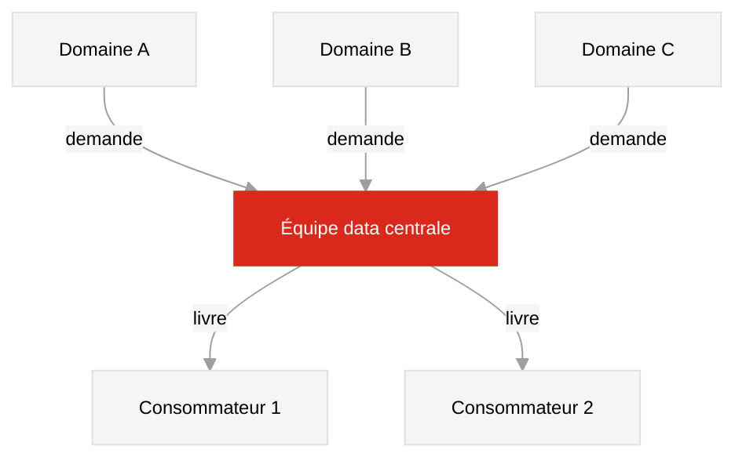
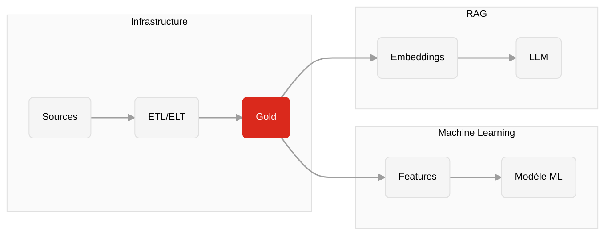

<div class="cover-custom">
  
  <div class="cover-content">
    <h1 class="cover-title">07 - Structures, flux et architectures modernes</h1>
    <p class="cover-subtitle">Infrastructure de données</p>
    <div style="display: flex; align-items: center; gap: 0.75rem; margin-top: 0.5rem;">
      <a href="https://github.com/MediaComem/comem-infradon" class="cover-email" target="_blank" style="display: flex; align-items: center; gap: 0.25rem;"><carbon-logo-github /> GitHub</a>
      <a href="https://creativecommons.org/licenses/by/4.0/" target="_blank"></a>
    </div>
    <div class="cover-meta">
      <span class="cover-author">Noemi Romano</span>
      <a href="mailto:noemi.romano@heig-vd.ch" class="cover-email">noemi.romano@heig-vd.ch</a>
      <span class="cover-date">{{ new Date().toLocaleDateString('fr-CH') }}</span>
    </div>
  </div>
</div>

---
layout: section
---

# Pourquoi le relationnel ne suffit pas toujours

<p class="section-subtitle">Quand les tables ne suffisent plus</p>

---
layout: default
---

# Les limites du modèle relationnel

<div class="grid grid-cols-2 gap-8 mt-4">

<div>

Le modèle relationnel est excellent pour les données **structurées, stables et cohérentes**.

Il montre ses limites quand :


- Le schéma change souvent (migrations coûteuses)
- Les données sont **imbriquées** naturellement : un produit avec 50 attributs optionnels
- La scalabilité horizontale devient nécessaire
- Le cas d'usage est **spécialisé** : graphe social, série temporelle, moteur de recherche


</div>

<div class="flex flex-col items-center justify-center h-full">


<p style="font-size: 0.65rem; color: #9e9e9e; text-align: center; margin-top: 0.3rem;">Source : <a href="https://www.scylladb.com/glossary/nosql-design-principles/" target="_blank" style="color: #9e9e9e;">ScyllaDB — NoSQL Design Principles</a></p>

</div>

</div>

<div class="accent-box mt-4">

Choisir une structure de données, c'est choisir quels compromis on accepte. Il n'y a pas de meilleure structure universelle !

</div>

---
layout: default
---

# Le spectre des structures de données

<div class="grid grid-cols-2 gap-8 mt-4">

<div style="font-size: 0.82rem;">

| Type | Cas d'usage typique | Exemples |
|------|---------------------|----------|
| **Relationnel** | OLTP, cohérence forte | PostgreSQL, MySQL |
| **Document** | Profils, contenus variables | MongoDB, Firestore |
| **Clé-valeur** | Cache, sessions, compteurs | Redis, DynamoDB |
| **Colonnes larges** | IoT, logs, métriques | Cassandra, HBase |
| **Graphe** | Réseaux, recommandations | Neo4j, ArangoDB |
| **Recherche** | Full-text, autocomplétion | Elasticsearch |

<div class="accent-box mt-4" style="font-size: 0.82rem;">

**PostgreSQL** supporte JSON, tableaux, géométrie (PostGIS) et recherche full-text, tout en restant relationnel.

</div>

</div>

<div class="flex flex-col items-center justify-center h-full">

<p style="font-size: 0.65rem; color: #9e9e9e; text-align: center; margin-top: 0.3rem;">Source : <a href="https://www.mongodb.com/resources/basics/databases/nosql-explained" target="_blank" style="color: #9e9e9e;">MongoDB — What is NoSQL?</a></p>
</div>

</div>

---
layout: section
---

# Les familles NoSQL

<p class="section-subtitle">Not Only SQL : Document, clé-valeur, colonnes, graphe</p>

---
layout: default
---

# NoSQL : Not Only SQL

<div class="grid grid-cols-2 gap-8 mt-4">

<div>

**NoSQL** ne signifie pas "sans SQL" : c'est l'abréviation de **Not Only SQL**.

Ces systèmes ne remplacent pas le relationnel : 

- Schémas **variables ou inconnus à l'avance**
- Volumes massifs nécessitant une **scalabilité horizontale**
- Structures de données **naturellement non tabulaires** (graphes, documents, séries temporelles)
- Latences **ultra-faibles** pour des accès simples par clé

</div>

<div class="flex flex-col items-center justify-center h-full">


<p style="font-size: 0.65rem; color: #9e9e9e; text-align: center; margin-top: 0.3rem;">Source : <a href="https://www.mongodb.com/resources/basics/databases/nosql-explained" target="_blank" style="color: #9e9e9e;">MongoDB — What is NoSQL?</a></p>

</div>

</div>

---
layout: default
---

# Document

<div class="grid grid-cols-2 gap-8 mt-4">

<div>

Chaque enregistrement est un **document JSON** (ou BSON). Le schéma est souple : deux documents de la même collection peuvent avoir des champs différents.

```json
{
  "id": "mobilier_042",
  "type": "lampadaire",
  "quartier": "Villette",
  "attributs": {
    "hauteur_m": 6.5,
    "puissance_w": 150,
    "technologie": "LED"
  },
  "signalements": [
    { "date": "2024-03-01", "motif": "panne" }
  ]
}
```


</div>

<div>

<div class="mt-3 flex flex-col items-center">

<p style="font-size: 0.65rem; color: #9e9e9e; text-align: center; margin-top: 0.2rem;">Source : <a href="https://www.mongodb.com/resources/basics/databases/nosql-explained" target="_blank" style="color: #9e9e9e;">MongoDB — What is NoSQL?</a></p>
</div>

<div style="background: #f2faf5; border: 1px solid #a8d5b5; border-radius: 4px; padding: 0.55rem 0.85rem; font-size: 0.84rem; margin-bottom: 0.8rem;">
  <div style="display: flex; align-items: center; gap: 0.35rem; font-weight: 600; margin-bottom: 0.1rem;"><carbon-checkmark style="color: #2d6a4f;" /> Avantages</div>
  Schéma flexible, imbrication native, pas de JOIN pour les lectures courantes
</div>

<div style="background: #fff5f5; border: 1px solid #f5b7b1; border-radius: 4px; padding: 0.55rem 0.85rem; font-size: 0.84rem; margin-bottom: 0.8rem;">
  <div style="display: flex; align-items: center; gap: 0.35rem; font-weight: 600; margin-bottom: 0.1rem;"><carbon-warning style="color: #c0392b;" /> Limites</div>
  Redondance des données, cohérence plus difficile à garantir, requêtes croisées coûteuses
</div>

<div style="background: #f5f5f5; border: 1px solid #e0e0e0; border-radius: 4px; padding: 0.45rem 0.85rem; font-size: 0.8rem;">
  <div style="font-weight: 600; color: #555; margin-bottom: 0.4rem;">Outils</div>
  <div style="display: flex; gap: 1rem; align-items: center; flex-wrap: wrap;">
    <a href="https://www.mongodb.com" target="_blank" style="display: flex; align-items: center; gap: 0.35rem; text-decoration: none; color: #000;"><span>MongoDB</span></a>
    <a href="https://firebase.google.com/docs/firestore" target="_blank" style="display: flex; align-items: center; gap: 0.35rem; text-decoration: none; color: #000;"><span>Firestore</span></a>
    <a href="https://couchdb.apache.org" target="_blank" style="display: flex; align-items: center; gap: 0.35rem; text-decoration: none; color: #000;"><span>CouchDB</span></a>
    <a href="https://arangodb.com" target="_blank" style="display: flex; align-items: center; gap: 0.35rem; text-decoration: none; color: #000;"><span>ArangoDB</span></a>
  </div>
</div>

</div>

</div>

<div class="footer">Source · <a href="https://www.mongodb.com/resources/basics/databases/nosql-explained" target="_blank">MongoDB : NoSQL Explained</a></div>

---
layout: default
---

# Clé-valeur

<div class="grid grid-cols-2 gap-8 mt-4">

<div>

La structure la plus simple : une **clé unique** associée à une **valeur** quelconque.

<div style="margin: 0.9rem 0; font-size: 0.82rem;">
<div style="display: flex; align-items: center; gap: 0.5rem; font-weight: 600; color: #555; margin-bottom: 0.4rem; font-size: 0.75rem; text-transform: uppercase; letter-spacing: 0.05em;">Exemples de paires clé → valeur</div>
<div style="display: flex; flex-direction: column; gap: 0.3rem;">
<div style="display: flex; align-items: center; gap: 0.5rem;"><code style="background: #f0f0f0; border-radius: 3px; padding: 0.15rem 0.4rem; font-size: 0.78rem; min-width: 200px;">session:user_42</code><span style="color: #9e9e9e;">→</span><span style="font-size: 0.78rem;">rôle + date d'expiration</span></div>
<div style="display: flex; align-items: center; gap: 0.5rem;"><code style="background: #f0f0f0; border-radius: 3px; padding: 0.15rem 0.4rem; font-size: 0.78rem; min-width: 200px;">compteur:signalements</code><span style="color: #9e9e9e;">→</span><span style="font-size: 0.78rem;">847</span></div>
<div style="display: flex; align-items: center; gap: 0.5rem;"><code style="background: #f0f0f0; border-radius: 3px; padding: 0.15rem 0.4rem; font-size: 0.78rem; min-width: 200px;">cache:mobilier:42</code><span style="color: #9e9e9e;">→</span><span style="font-size: 0.78rem;">résultat d'une requête SQL</span></div>
</div>
</div>

L'accès est en **O(1)** : temps constant quelle que soit la taille de la base, comme trouver une veste au vestiaire avec son numéro : une seule opération, pas de recherche.

**Cas d'usage :** sessions, cache de requêtes, pub/sub, rate limiting d'API.

</div>

<div>

<div style="background: #f2faf5; border: 1px solid #a8d5b5; border-radius: 4px; padding: 0.55rem 0.85rem; font-size: 0.84rem; margin-bottom: 0.8rem;">
  <div style="display: flex; align-items: center; gap: 0.35rem; font-weight: 600; margin-bottom: 0.1rem;"><carbon-checkmark style="color: #2d6a4f;" /> Avantages</div>
  Latence sous la milliseconde, scalabilité horizontale, structures de données riches (listes, sets, streams)
</div>

<div style="background: #fff5f5; border: 1px solid #f5b7b1; border-radius: 4px; padding: 0.55rem 0.85rem; font-size: 0.84rem; margin-bottom: 0.8rem;">
  <div style="display: flex; align-items: center; gap: 0.35rem; font-weight: 600; margin-bottom: 0.1rem;"><carbon-warning style="color: #c0392b;" /> Limites</div>
  Pas de requête, pas de filtre : on sait ce qu'on cherche avant de chercher
</div>

<div style="background: #f5f5f5; border: 1px solid #e0e0e0; border-radius: 4px; padding: 0.45rem 0.85rem; font-size: 0.8rem;">
  <div style="font-weight: 600; color: #555; margin-bottom: 0.4rem;">Outils</div>
  <div style="display: flex; gap: 1rem; align-items: center; flex-wrap: wrap;">
    <a href="https://redis.io" target="_blank" style="display: flex; align-items: center; gap: 0.35rem; text-decoration: none; color: #000;"><span>Redis</span></a>
    <a href="https://aws.amazon.com/dynamodb/" target="_blank" style="display: flex; align-items: center; gap: 0.35rem; text-decoration: none; color: #000;"><span>DynamoDB</span></a>
    <a href="https://memcached.org" target="_blank" style="display: flex; align-items: center; gap: 0.35rem; text-decoration: none; color: #000;"><span>Memcached</span></a>
  </div>
</div>

</div>

</div>

<div class="footer">Source · <a href="https://redis.io/docs/latest/develop/get-started/" target="_blank">Redis Documentation</a></div>

---
layout: default
---

# Colonnes larges

<div class="grid grid-cols-2 gap-8 mt-4">

<div>

Les données sont organisées par **ligne + colonne**, mais chaque ligne peut avoir des colonnes différentes et les colonnes sont regroupées en **familles**.

**Cas d'usage :**

- Métriques IoT (un capteur = une ligne, timestamp = colonne)
- Logs applicatifs à haute fréquence
- Historique de positions GPS
- Analytics à grande échelle

</div>

<div>

<div style="margin-bottom: 0.8rem; font-size: 0.74rem; overflow-x: auto;">
<div style="font-weight: 600; color: #555; margin-bottom: 0.35rem; font-size: 0.72rem; text-transform: uppercase; letter-spacing: 0.05em;">Exemple : mesures de capteurs IoT</div>
<table style="border-collapse: collapse; width: 100%;">
<thead><tr style="background: #f0f0f0;"><th style="border: 1px solid #e0e0e0; padding: 0.2rem 0.45rem; text-align: left;">Row key</th><th style="border: 1px solid #e0e0e0; padding: 0.2rem 0.45rem; background: #e8f0e8;">info:type</th><th style="border: 1px solid #e0e0e0; padding: 0.2rem 0.45rem; background: #e8f0e8;">info:quartier</th><th style="border: 1px solid #e0e0e0; padding: 0.2rem 0.45rem; background: #e8eef8;">mesures:2024-03-01</th><th style="border: 1px solid #e0e0e0; padding: 0.2rem 0.45rem; background: #e8eef8;">mesures:2024-03-02</th></tr></thead>
<tbody>
<tr><td style="border: 1px solid #e0e0e0; padding: 0.2rem 0.45rem; font-family: monospace;">capteur_001</td><td style="border: 1px solid #e0e0e0; padding: 0.2rem 0.45rem; background: #f5fbf5;">lampadaire</td><td style="border: 1px solid #e0e0e0; padding: 0.2rem 0.45rem; background: #f5fbf5;">Villette</td><td style="border: 1px solid #e0e0e0; padding: 0.2rem 0.45rem; background: #f0f5ff;">145 W</td><td style="border: 1px solid #e0e0e0; padding: 0.2rem 0.45rem; background: #f0f5ff;">152 W</td></tr>
<tr><td style="border: 1px solid #e0e0e0; padding: 0.2rem 0.45rem; font-family: monospace;">capteur_002</td><td style="border: 1px solid #e0e0e0; padding: 0.2rem 0.45rem; background: #f5fbf5;">fontaine</td><td style="border: 1px solid #e0e0e0; padding: 0.2rem 0.45rem; background: #f5fbf5;">Centre</td><td style="border: 1px solid #e0e0e0; padding: 0.2rem 0.45rem; background: #f0f5ff; color: #bbb; font-style: italic;">—</td><td style="border: 1px solid #e0e0e0; padding: 0.2rem 0.45rem; background: #f0f5ff;">actif</td></tr>
<tr><td style="border: 1px solid #e0e0e0; padding: 0.2rem 0.45rem; font-family: monospace;">capteur_003</td><td style="border: 1px solid #e0e0e0; padding: 0.2rem 0.45rem; background: #f5fbf5;">banc</td><td style="border: 1px solid #e0e0e0; padding: 0.2rem 0.45rem; background: #f5fbf5; color: #bbb; font-style: italic;">—</td><td style="border: 1px solid #e0e0e0; padding: 0.2rem 0.45rem; background: #f0f5ff;">ok</td><td style="border: 1px solid #e0e0e0; padding: 0.2rem 0.45rem; background: #f0f5ff; color: #bbb; font-style: italic;">—</td></tr>
</tbody>
</table>
<div style="color: #9e9e9e; margin-top: 0.3rem;">Familles : <span style="background: #e8f0e8; padding: 0.05rem 0.3rem; border-radius: 2px;">info:</span> stable · <span style="background: #e8eef8; padding: 0.05rem 0.3rem; border-radius: 2px;">mesures:</span> timestampée, clairsemée</div>
</div>

<div style="background: #f2faf5; border: 1px solid #a8d5b5; border-radius: 4px; padding: 0.55rem 0.85rem; font-size: 0.84rem; margin-bottom: 0.8rem;">
  <div style="display: flex; align-items: center; gap: 0.35rem; font-weight: 600; margin-bottom: 0.1rem;"><carbon-checkmark style="color: #2d6a4f;" /> Avantages</div>
  Scalabilité horizontale massive, aucun point de défaillance unique (SPOF), écriture ultra-rapide
</div>

<div style="background: #fff5f5; border: 1px solid #f5b7b1; border-radius: 4px; padding: 0.55rem 0.85rem; font-size: 0.84rem; margin-bottom: 0.8rem;">
  <div style="display: flex; align-items: center; gap: 0.35rem; font-weight: 600; margin-bottom: 0.1rem;"><carbon-warning style="color: #c0392b;" /> Limites</div>
  Pas de transactions ACID complètes, pas de JOIN, schéma de requête doit être pensé à l'avance
</div>

<div style="background: #f5f5f5; border: 1px solid #e0e0e0; border-radius: 4px; padding: 0.45rem 0.85rem; font-size: 0.8rem;">
  <div style="font-weight: 600; color: #555; margin-bottom: 0.4rem;">Outils</div>
  <div style="display: flex; gap: 1rem; align-items: center; flex-wrap: wrap;">
    <a href="https://cassandra.apache.org" target="_blank" style="display: flex; align-items: center; gap: 0.35rem; text-decoration: none; color: #000;"><span>Cassandra</span></a>
    <a href="https://hbase.apache.org" target="_blank" style="display: flex; align-items: center; gap: 0.35rem; text-decoration: none; color: #000;"><span>HBase</span></a>
    <a href="https://www.scylladb.com" target="_blank" style="display: flex; align-items: center; gap: 0.35rem; text-decoration: none; color: #000;"><span>ScyllaDB</span></a>
  </div>
</div>

</div>

</div>

<div class="footer">Source · <a href="https://cassandra.apache.org/doc/latest/" target="_blank">Apache Cassandra Documentation</a></div>

---
layout: default
---

# Graphe

<div class="grid grid-cols-2 gap-8 mt-4">

<div>

Dans un graphe, les **relations entre entités** sont aussi importantes que les entités elles-mêmes.

Structure : **noeuds** (entités) + **arêtes** (relations) + **propriétés** sur chacun.

```cypher
-- Qui a signalé un problème sur le banc 12 ?
MATCH (p:Personne)-[:A_SIGNALE]->(s:Signalement)
      -[:CONCERNE]->(m:Mobilier {id: 12})
RETURN p.nom, s.date, s.motif
```

**Cas d'usage :** réseaux sociaux, recommandations, détection de fraude, dépendances logicielles.

</div>

<div>


<div style="background: #f2faf5; border: 1px solid #a8d5b5; border-radius: 4px; padding: 0.55rem 0.85rem; font-size: 0.84rem; margin-bottom: 0.8rem;">
  <div style="display: flex; align-items: center; gap: 0.35rem; font-weight: 600; margin-bottom: 0.1rem;"><carbon-checkmark style="color: #2d6a4f;" /> Avantages</div>
  Traversées de relations en O(1), requêtes multi-sauts naturelles, modélisation proche du réel
</div>

<div style="background: #fff5f5; border: 1px solid #f5b7b1; border-radius: 4px; padding: 0.55rem 0.85rem; font-size: 0.84rem; margin-bottom: 0.8rem;">
  <div style="display: flex; align-items: center; gap: 0.35rem; font-weight: 600; margin-bottom: 0.1rem;"><carbon-warning style="color: #c0392b;" /> Limites</div>
  Scalabilité difficile sur très grands graphes, moins adapté aux données tabulaires classiques
</div>

<div style="background: #f5f5f5; border: 1px solid #e0e0e0; border-radius: 4px; padding: 0.45rem 0.85rem; font-size: 0.8rem;">
  <div style="font-weight: 600; color: #555; margin-bottom: 0.4rem;">Outils</div>
  <div style="display: flex; gap: 1rem; align-items: center; flex-wrap: wrap;">
    <a href="https://neo4j.com" target="_blank" style="display: flex; align-items: center; gap: 0.35rem; text-decoration: none; color: #000;"><span>Neo4j</span></a>
    <a href="https://arangodb.com" target="_blank" style="display: flex; align-items: center; gap: 0.35rem; text-decoration: none; color: #000;"><span>ArangoDB</span></a>
    <a href="https://aws.amazon.com/neptune/" target="_blank" style="display: flex; align-items: center; gap: 0.35rem; text-decoration: none; color: #000;"><span>Amazon Neptune</span></a>
  </div>
</div>

</div>

</div>

<div class="footer">Source · <a href="https://neo4j.com/docs/" target="_blank">Neo4j Documentation</a></div>

---
layout: default
---

# Quand choisir quelle structure ?

<div class="mt-4" style="font-size: 0.85rem;">

| Question | Structure recommandée |
|----------|----------------------|
| Données structurées avec relations et cohérence forte | **Relationnel** (PostgreSQL) |
| Contenu variable, documents imbriqués, schéma souple | **Document** (MongoDB) |
| Cache, sessions, accès par clé unique ultra-rapide | **Clé-valeur** (Redis) |
| Métriques, logs, IoT, séries temporelles à grande échelle | **Colonnes larges** (Cassandra) |
| Réseaux, recommandations, détection de fraude | **Graphe** (Neo4j) |
| Recherche textuelle, autocomplétion, filtres facettes | **Recherche** (Elasticsearch) |

</div>

<div class="mt-4" style="background: #fffbe6; border: 1px solid #f0d060; border-radius: 4px; padding: 0.55rem 0.85rem; font-size: 0.84rem;">
  <carbon-warning-alt style="color: #c8a000;" /> En pratique, la plupart des systèmes modernes combinent plusieurs structures. Instagram utilise PostgreSQL, Redis et Cassandra ensemble.
</div>

---
layout: default
---

# L'écosystème des solutions de stockage

<div class="mt-3" style="font-size: 0.78rem;">

| Type | Open-source | Cloud managé | Spécialité |
|------|-------------|--------------|------------|
| **Document** | [MongoDB](https://www.mongodb.com) · [CouchDB](https://couchdb.apache.org) · [ArangoDB](https://arangodb.com) | [Firestore](https://firebase.google.com/docs/firestore) · [Cosmos DB](https://azure.microsoft.com/products/cosmos-db) · [Atlas](https://www.mongodb.com/atlas) | Schéma flexible, imbrication |
| **Clé-valeur** | [Redis](https://redis.io) · [Memcached](https://memcached.org) · [etcd](https://etcd.io) | [ElastiCache](https://aws.amazon.com/elasticache/) · [DynamoDB](https://aws.amazon.com/dynamodb/) | Cache, sessions, pub/sub |
| **Colonnes larges** | [Cassandra](https://cassandra.apache.org) · [HBase](https://hbase.apache.org) · [ScyllaDB](https://www.scylladb.com) | [Bigtable](https://cloud.google.com/bigtable) · [Keyspaces](https://aws.amazon.com/keyspaces/) | IoT, logs, séries temporelles |
| **Graphe** | [Neo4j](https://neo4j.com) · [ArangoDB](https://arangodb.com) · [JanusGraph](https://janusgraph.org) | [Neptune](https://aws.amazon.com/neptune/) · [Cosmos DB](https://azure.microsoft.com/products/cosmos-db) | Réseaux, recommandations, fraude |
| **Recherche** | [Elasticsearch](https://www.elastic.co) · [OpenSearch](https://opensearch.org) · [Typesense](https://typesense.org) | [Elastic Cloud](https://www.elastic.co/cloud) · [Algolia](https://www.algolia.com) | Full-text, facettes, autocomplétion |
| **Séries temporelles** | [InfluxDB](https://www.influxdata.com) · [TimescaleDB](https://www.timescale.com) · [Prometheus](https://prometheus.io) | [Timestream](https://aws.amazon.com/timestream/) | Métriques, monitoring, IoT |
| **Vecteurs / IA** | [Weaviate](https://weaviate.io) · [Chroma](https://www.trychroma.com) · [Qdrant](https://qdrant.tech) | [Pinecone](https://www.pinecone.io) · [pgvector](https://github.com/pgvector/pgvector) | Embeddings, RAG |

</div>

<div class="footer">Source · <a href="https://db-engines.com/en/ranking" target="_blank">db-engines.com : DBMS Ranking</a></div>

---
layout: section
---

# Flux de données

<p class="section-subtitle">ETL, ELT et changements en temps réel</p>

---
layout: default
---

# Les données ne restent pas en place

<div class="grid grid-cols-2 gap-8 mt-4">

<div>

Les systèmes de données réels ne sont pas statiques. Les données :

- Arrivent de **sources multiples** (APIs, fichiers, bases opérationnelles)
- Doivent être **transformées** pour être exploitables
- Circulent vers des **destinations** (entrepôts, dashboards, modèles d'IA)
- Changent en **continu** au fil des opérations

Un **pipeline de données** est une séquence d'étapes qui collecte, transforme et livre la donnée de la source à la destination.

</div>

<div class="flex items-center justify-center h-full">


</div>

</div>

---
layout: default
---

# ETL : Extract, Transform, Load

<div class="grid grid-cols-2 gap-8 mt-4">

<div>

La donnée est **transformée avant d'être chargée** dans la destination.

<div style="display: flex; align-items: center; gap: 0.5rem; margin: 1.2rem 0;">
  <div style="background: #f5f5f5; border: 1px solid #e0e0e0; border-radius: 6px; padding: 0.6rem 0.9rem; text-align: center; min-width: 90px;">
    <div style="font-weight: 600; font-size: 0.82rem;">Sources</div>
    <div style="color: #9e9e9e; font-size: 0.72rem; margin-top: 0.2rem;">Excel, APIs, CSV</div>
  </div>
  <span style="color: #9e9e9e; font-size: 1.3rem; flex-shrink: 0;">→</span>
  <div style="background: #f5f5f5; border: 1px solid #9e9e9e; border-radius: 6px; padding: 0.6rem 0.9rem; text-align: center; min-width: 110px;">
    <div style="font-weight: 600; font-size: 0.82rem;">Transform</div>
    <div style="color: #9e9e9e; font-size: 0.72rem; margin-top: 0.2rem;">Nettoyage, jointures</div>
  </div>
  <span style="color: #9e9e9e; font-size: 1.3rem; flex-shrink: 0;">→</span>
  <div style="background: #DA291C; border: 1px solid #DA291C; border-radius: 6px; padding: 0.6rem 0.9rem; text-align: center; min-width: 110px;">
    <div style="font-weight: 600; font-size: 0.82rem; color: #fff;">Load</div>
    <div style="color: rgba(255,255,255,0.8); font-size: 0.72rem; margin-top: 0.2rem;">Entrepôt propre</div>
  </div>
</div>

L'outil de transformation est **externe** à la base de destination.

</div>

<div>

<div style="background: #f5f5f5; border: 1px solid #e0e0e0; border-radius: 4px; padding: 0.55rem 0.85rem; font-size: 0.84rem; margin-bottom: 0.8rem;">
  <div style="font-weight: 600; margin-bottom: 0.1rem;">Exemple classique</div>
  Un script Python lit des fichiers Excel, nettoie les données, et charge le résultat dans PostgreSQL
</div>

<div style="background: #f2faf5; border: 1px solid #a8d5b5; border-radius: 4px; padding: 0.55rem 0.85rem; font-size: 0.84rem; margin-bottom: 0.8rem;">
  <div style="display: flex; align-items: center; gap: 0.35rem; font-weight: 600; margin-bottom: 0.1rem;"><carbon-checkmark style="color: #2d6a4f;" /> Avantages</div>
  Données propres dès l'arrivée, charge légère sur la destination
</div>

<div style="background: #fff5f5; border: 1px solid #f5b7b1; border-radius: 4px; padding: 0.55rem 0.85rem; font-size: 0.84rem; margin-bottom: 0.8rem;">
  <div style="display: flex; align-items: center; gap: 0.35rem; font-weight: 600; margin-bottom: 0.1rem;"><carbon-warning style="color: #c0392b;" /> Limites</div>
  La donnée brute est perdue, les transformations sont souvent mal documentées et fragiles
</div>

<div style="background: #f5f5f5; border: 1px solid #e0e0e0; border-radius: 4px; padding: 0.45rem 0.85rem; font-size: 0.8rem;">
  <div style="font-weight: 600; color: #555; margin-bottom: 0.4rem;">Outils</div>
  <div style="display: flex; gap: 1rem; align-items: center; flex-wrap: wrap;">
    <a href="https://airflow.apache.org" target="_blank" style="display: flex; align-items: center; gap: 0.35rem; text-decoration: none; color: #000;"><span>Apache Airflow</span></a>
    <a href="https://www.prefect.io" target="_blank" style="display: flex; align-items: center; gap: 0.35rem; text-decoration: none; color: #000;"><span>Prefect</span></a>
    <a href="https://www.safe.com/fme/" target="_blank" style="display: flex; align-items: center; gap: 0.35rem; text-decoration: none; color: #000;"><span>FME</span></a>
    <a href="https://www.talend.com" target="_blank" style="display: flex; align-items: center; gap: 0.35rem; text-decoration: none; color: #000;"><span>Talend</span></a>
    <a href="https://www.informatica.com" target="_blank" style="display: flex; align-items: center; gap: 0.35rem; text-decoration: none; color: #000;"><span>Informatica</span></a>
  </div>
</div>

</div>

</div>

---
layout: default
---

# ELT : Extract, Load, Transform

<div class="grid grid-cols-2 gap-8 mt-4">

<div>

Les données brutes sont **d'abord chargées**, puis transformées **à l'intérieur** du système de destination.

<div style="display: flex; align-items: center; gap: 0.5rem; margin: 1.2rem 0; flex-wrap: wrap;">
  <div style="background: #f5f5f5; border: 1px solid #e0e0e0; border-radius: 6px; padding: 0.6rem 0.9rem; text-align: center; min-width: 90px;">
    <div style="font-weight: 600; font-size: 0.82rem;">Sources</div>
    <div style="color: #9e9e9e; font-size: 0.72rem; margin-top: 0.2rem;">Excel, APIs, CSV</div>
  </div>
  <span style="color: #9e9e9e; font-size: 1.3rem; flex-shrink: 0;">→</span>
  <div style="background: #f5f5f5; border: 1px solid #9e9e9e; border-radius: 6px; padding: 0.6rem 0.9rem; text-align: center; min-width: 110px;">
    <div style="font-weight: 600; font-size: 0.82rem;">Load</div>
    <div style="color: #9e9e9e; font-size: 0.72rem; margin-top: 0.2rem;">Tables staging brutes</div>
  </div>
  <span style="color: #9e9e9e; font-size: 1.3rem; flex-shrink: 0;">→</span>
  <div style="background: #f5f5f5; border: 1px solid #9e9e9e; border-radius: 6px; padding: 0.6rem 0.9rem; text-align: center; min-width: 110px;">
    <div style="font-weight: 600; font-size: 0.82rem;">Transform</div>
    <div style="color: #9e9e9e; font-size: 0.72rem; margin-top: 0.2rem;">SQL dans la base</div>
  </div>
  <span style="color: #9e9e9e; font-size: 1.3rem; flex-shrink: 0;">→</span>
  <div style="background: #DA291C; border: 1px solid #DA291C; border-radius: 6px; padding: 0.6rem 0.9rem; text-align: center; min-width: 110px;">
    <div style="font-weight: 600; font-size: 0.82rem; color: #fff;">Marts</div>
    <div style="color: rgba(255,255,255,0.8); font-size: 0.72rem; margin-top: 0.2rem;">Données exploitables</div>
  </div>
</div>

</div>

<div>


<div style="background: #f2faf5; border: 1px solid #a8d5b5; border-radius: 4px; padding: 0.55rem 0.85rem; font-size: 0.84rem; margin-bottom: 0.8rem;">
  <div style="display: flex; align-items: center; gap: 0.35rem; font-weight: 600; margin-bottom: 0.1rem;"><carbon-checkmark style="color: #2d6a4f;" /> Avantages</div>
  Données brutes conservées, transformations versionnées, rejouables
</div>

<div style="background: #fff5f5; border: 1px solid #f5b7b1; border-radius: 4px; padding: 0.55rem 0.85rem; font-size: 0.84rem; margin-bottom: 0.8rem;">
  <div style="display: flex; align-items: center; gap: 0.35rem; font-weight: 600; margin-bottom: 0.1rem;"><carbon-warning style="color: #c0392b;" /> Limites</div>
  La destination doit être assez puissante pour les transformations
</div>

<div style="background: #f5f5f5; border: 1px solid #e0e0e0; border-radius: 4px; padding: 0.45rem 0.85rem; font-size: 0.8rem;">
  <div style="font-weight: 600; color: #555; margin-bottom: 0.4rem;">Outils</div>
  <div style="display: flex; gap: 1rem; align-items: center; flex-wrap: wrap;">
    <a href="https://spark.apache.org" target="_blank" style="display: flex; align-items: center; gap: 0.35rem; text-decoration: none; color: #000;"><span>Apache Spark</span></a>
    <a href="https://cloud.google.com/bigquery" target="_blank" style="display: flex; align-items: center; gap: 0.35rem; text-decoration: none; color: #000;"><span>BigQuery</span></a>
    <a href="https://www.snowflake.com" target="_blank" style="display: flex; align-items: center; gap: 0.35rem; text-decoration: none; color: #000;"><span>Snowflake</span></a>
    <a href="https://aws.amazon.com/redshift/" target="_blank" style="display: flex; align-items: center; gap: 0.35rem; text-decoration: none; color: #000;"><span>Redshift</span></a>
    <a href="https://airflow.apache.org" target="_blank" style="display: flex; align-items: center; gap: 0.35rem; text-decoration: none; color: #000;"><span>Airflow</span></a>
  </div>
</div>

</div>

</div>

---
layout: default
---

# ETL vs ELT : comparaison

<div class="mt-4" style="font-size: 0.85rem;">

| Critère | ETL | ELT |
|---------|-----|-----|
| Ordre | Extract → Transform → Load | Extract → Load → Transform |
| Données brutes | Perdues après transformation | Conservées (couche staging / Bronze) |
| Outil de transformation | Externe (Python, Spark) | SQL dans la destination |
| Rejouer les transformations | Difficile si les brutes sont perdues | Facile, les brutes sont là |
| Cas d'usage typique | Data warehouse traditionnel | Entrepôt cloud moderne |
| Exemple | Talend, Informatica | SQL + PostgreSQL / BigQuery |

</div>

<div class="accent-box mt-6">

L'ELT est devenu le standard moderne grâce à la puissance des bases cloud. C'est le pattern que vous pratiquez dans le projet avec vos tables staging.

</div>

---
layout: section
---

# Stratégies de stockage

<p class="section-subtitle">Data warehouse, data lake et lakehouse</p>

---
layout: default
---

# Le data warehouse

Un **data warehouse** (entrepôt de données) est une base centralisée conçue pour l'**analyse** et le reporting, pas pour les transactions du quotidien.

<div class="grid grid-cols-2 gap-8 mt-4">

<div>

Les données y sont extraites de plusieurs systèmes sources (ERP, CRM, bases opérationnelles), nettoyées et organisées selon un **schéma fixe optimisé pour les requêtes OLAP**.

**Cas d'usage :** dashboards de direction, rapports financiers, historique des ventes.

<div style="background: #f2faf5; border: 1px solid #a8d5b5; border-radius: 4px; padding: 0.55rem 0.85rem; font-size: 0.84rem; margin-top: 0.8rem;">
  <div style="display: flex; align-items: center; gap: 0.35rem; font-weight: 600; margin-bottom: 0.1rem;"><carbon-checkmark style="color: #2d6a4f;" /> Avantages</div>
  Données propres, requêtes analytiques rapides, fiabilité éprouvée
</div>

<div style="background: #fff5f5; border: 1px solid #f5b7b1; border-radius: 4px; padding: 0.55rem 0.85rem; font-size: 0.84rem; margin-top: 0.8rem;">
  <div style="display: flex; align-items: center; gap: 0.35rem; font-weight: 600; margin-bottom: 0.1rem;"><carbon-warning style="color: #c0392b;" /> Limites</div>
  Schéma rigide, coûteux à faire évoluer, mal adapté aux données non structurées
</div>

</div>

<div>


<p style="font-size: 0.62rem; color: #9e9e9e; text-align: center; margin-bottom: 0.6rem;">Source : <a href="https://www.geeksforgeeks.org/big-data/data-warehousing/" target="_blank" style="color: #9e9e9e;">GeeksforGeeks — Data Warehousing</a></p>

<div style="background: #f5f5f5; border: 1px solid #e0e0e0; border-radius: 4px; padding: 0.55rem 0.85rem; font-size: 0.84rem; margin-bottom: 0.8rem;">
  <div style="font-weight: 600; margin-bottom: 0.5rem; color: #555;">Outils</div>
  <div style="display: flex; gap: 1rem; align-items: center; flex-wrap: wrap;">
    <a href="https://aws.amazon.com/redshift/" target="_blank" style="display: flex; align-items: center; gap: 0.35rem; text-decoration: none; color: #000; font-size: 0.8rem;"><span>Redshift</span></a>
    <a href="https://cloud.google.com/bigquery" target="_blank" style="display: flex; align-items: center; gap: 0.35rem; text-decoration: none; color: #000; font-size: 0.8rem;"><span>BigQuery</span></a>
    <a href="https://www.snowflake.com" target="_blank" style="display: flex; align-items: center; gap: 0.35rem; text-decoration: none; color: #000; font-size: 0.8rem;"><span>Snowflake</span></a>
    <a href="https://azure.microsoft.com/products/synapse-analytics" target="_blank" style="display: flex; align-items: center; gap: 0.35rem; text-decoration: none; color: #000; font-size: 0.8rem;"><span>Azure Synapse</span></a>
  </div>
</div>


</div>

</div>

---
layout: default
---

# Le data lake

Un **data lake** (lac de données) stocke toutes les données brutes : structurées, semi-structurées ou non structurées, dans leur format d'origine, sans schéma imposé à l'écriture.

<div class="grid grid-cols-2 gap-8 mt-4">

<div>

Le schéma est défini **au moment de la lecture** ("schema on read"), pas à l'écriture. Cela permet d'ingérer des données très diverses : JSON, images, logs, fichiers CSV, vidéos.

**Cas d'usage :** archivage massif, données IoT, machine learning sur données brutes.

<div style="background: #f2faf5; border: 1px solid #a8d5b5; border-radius: 4px; padding: 0.55rem 0.85rem; font-size: 0.84rem; margin-top: 0.8rem;">
  <div style="display: flex; align-items: center; gap: 0.35rem; font-weight: 600; margin-bottom: 0.1rem;"><carbon-checkmark style="color: #2d6a4f;" /> Avantages</div>
  Stockage bon marché, accepte tout format, idéal pour le ML
</div>

<div style="background: #fff5f5; border: 1px solid #f5b7b1; border-radius: 4px; padding: 0.55rem 0.85rem; font-size: 0.84rem; margin-top: 0.8rem;">
  <div style="display: flex; align-items: center; gap: 0.35rem; font-weight: 600; margin-bottom: 0.1rem;"><carbon-warning style="color: #c0392b;" /> Limites</div>
  Sans gouvernance, devient un <strong>data swamp</strong> : données introuvables, non fiables, non documentées
</div>

</div>

<div>


<p style="font-size: 0.62rem; color: #9e9e9e; text-align: center; margin-bottom: 0.6rem;">Source : <a href="https://www.qlik.com/us/data-lake" target="_blank" style="color: #9e9e9e;">Qlik — What is a Data Lake?</a></p>

<div style="background: #f5f5f5; border: 1px solid #e0e0e0; border-radius: 4px; padding: 0.55rem 0.85rem; font-size: 0.84rem; margin-bottom: 0.8rem;">
  <div style="font-weight: 600; margin-bottom: 0.5rem; color: #555;">Outils</div>
  <div style="display: flex; gap: 1rem; align-items: center; flex-wrap: wrap;">
    <a href="https://aws.amazon.com/s3/" target="_blank" style="display: flex; align-items: center; gap: 0.35rem; text-decoration: none; color: #000; font-size: 0.8rem;"><span>Amazon S3</span></a>
    <a href="https://azure.microsoft.com/products/storage/data-lake-storage" target="_blank" style="display: flex; align-items: center; gap: 0.35rem; text-decoration: none; color: #000; font-size: 0.8rem;"><span>Azure Data Lake</span></a>
    <a href="https://cloud.google.com/storage" target="_blank" style="display: flex; align-items: center; gap: 0.35rem; text-decoration: none; color: #000; font-size: 0.8rem;"><span>GCS</span></a>
  </div>
</div>


</div>

</div>


<div class="footer">Source · <a href="https://www.cidrdb.org/cidr2021/papers/cidr2021_paper17.pdf" target="_blank">Armbrust et al., <em>Lakehouse</em> (CIDR 2021)</a></div>


---
layout: default
---

# Architecture Medallion

<div class="grid grid-cols-2 gap-8 mt-4">

<div style="display: flex; gap: 0.6rem; align-items: stretch; font-size: 0.84rem;">
  <div style="display: flex; flex-direction: column; align-items: center; width: 26px; flex-shrink: 0;">
    <div style="font-size: 0.6rem; font-weight: 700; writing-mode: vertical-rl; transform: rotate(180deg); color: #555; letter-spacing: 0.08em; white-space: nowrap; padding-bottom: 0.3rem;">QUALITÉ DE LA DONNÉE</div>
    <div style="flex: 1; width: 2px; background: #555; position: relative;"><div style="position: absolute; bottom: -7px; left: 50%; transform: translateX(-50%); width: 0; height: 0; border-left: 5px solid transparent; border-right: 5px solid transparent; border-top: 8px solid #555;"></div></div>
  </div>
  <div style="display: flex; flex-direction: column; gap: 0.7rem; flex: 1;">
    <div style="background: #f5f5f5; border-left: 4px solid #9e9e9e; border-radius: 0 4px 4px 0; padding: 0.55rem 0.85rem;"><div style="font-weight: 600; margin-bottom: 0.15rem;">Bronze</div>Données brutes ingérées telles quelles. Historique complet. Aucune transformation.<div style="font-style: italic; color: #9e9e9e; font-size: 0.78rem; margin-top: 0.2rem;">"Ce qu'on a reçu."</div></div>
    <div style="background: #f5f5f5; border-left: 4px solid #555; border-radius: 0 4px 4px 0; padding: 0.55rem 0.85rem;"><div style="font-weight: 600; margin-bottom: 0.15rem;">Silver</div>Données nettoyées, typées, dédupliquées. Jointures entre sources. Qualité vérifiée.<div style="font-style: italic; color: #9e9e9e; font-size: 0.78rem; margin-top: 0.2rem;">"Ce qu'on a compris."</div></div>
    <div style="background: #f5f5f5; border-left: 4px solid #c8a000; border-radius: 0 4px 4px 0; padding: 0.55rem 0.85rem;"><div style="font-weight: 600; margin-bottom: 0.15rem;">Gold</div>Données agrégées, prêtes pour l'analyse. KPIs, dimensions, métriques métier.<div style="font-style: italic; color: #9e9e9e; font-size: 0.78rem; margin-top: 0.2rem;">"Ce qu'on peut utiliser."</div></div>
  </div>
</div>

<div>

<a href="https://www.flexera.com/blog/finops/medallion-architecture/" target="_blank">
  
</a>
<div style="font-size: 0.68rem; color: #9e9e9e; margin-top: 0.3rem;">
  <a href="https://www.flexera.com/blog/finops/medallion-architecture/" target="_blank" style="color: #9e9e9e;">flexera.com — Medallion Architecture</a>
</div>

</div>

</div>

<div class="footer">Source · <a href="https://www.databricks.com/glossary/medallion-architecture" target="_blank">Databricks — Medallion Architecture</a></div>

---
layout: default
---

# Lakehouse

<div class="grid grid-cols-2 gap-8 mt-4">
<div style="font-size: 0.82rem;">

Le **lakehouse** part d'un data lake (stockage objet, formats ouverts) et y ajoute une **couche de fiabilité** absente du lac brut :

<div style="display: grid; grid-template-columns: 1fr 1fr; gap: 0.5rem; margin-top: 0.6rem;">

<div style="background: #f5f5f5; border: 1px solid #e0e0e0; border-radius: 4px; padding: 0.5rem 0.7rem;">
  <div style="font-weight: 600; margin-bottom: 0.2rem;">Transactions ACID</div>
  Écriture atomique sur fichiers distribués : plus de fichiers corrompus ou partiellement écrits.
</div>

<div style="background: #f5f5f5; border: 1px solid #e0e0e0; border-radius: 4px; padding: 0.5rem 0.7rem;">
  <div style="font-weight: 600; margin-bottom: 0.2rem;">Catalogue de métadonnées</div>
  Chaque dataset a un schéma, une description, un propriétaire, une lignée (<em>lineage</em>). On sait ce qui existe et à qui faire confiance.
</div>

<div style="background: #f5f5f5; border: 1px solid #e0e0e0; border-radius: 4px; padding: 0.5rem 0.7rem;">
  <div style="font-weight: 600; margin-bottom: 0.2rem;">Time travel</div>
  Chaque modification est versionnée. On peut interroger l'état des données à une date passée ou annuler une erreur.
</div>

<div style="background: #f5f5f5; border: 1px solid #e0e0e0; border-radius: 4px; padding: 0.5rem 0.7rem;">
  <div style="font-weight: 600; margin-bottom: 0.2rem;">Couche qualité (Medallion)</div>
  Bronze → Silver → Gold : chaque étape applique validation, déduplication et enrichissement, avec schéma contrôlé.
</div>

</div>

<div style="font-size: 0.72rem; color: #555; margin-top: 0.5rem;">Formats : <strong>Delta Lake</strong>, <strong>Apache Iceberg</strong>, <strong>Apache Hudi</strong></div>

</div>
<div style="display: flex; flex-direction: column; gap: 0.4rem;">
<a href="https://www.qlik.com/us/data-lake/data-lakehouse" target="_blank">
  
</a>
<div style="font-size: 0.62rem; color: #9e9e9e; text-align: center; margin-bottom: 0.3rem;"><a href="https://www.qlik.com/us/data-lake/data-lakehouse" target="_blank" style="color: #9e9e9e;">qlik.com — Data lakehouse</a></div>
<div style="background: #f2faf5; border: 1px solid #a8d5b5; border-radius: 4px; padding: 0.5rem 0.7rem; font-size: 0.8rem;">
  <div style="display: flex; align-items: center; gap: 0.35rem; font-weight: 600; margin-bottom: 0.1rem;"><carbon-checkmark style="color: #2d6a4f;" /> Avantages</div>
  Flexibilité du lac + fiabilité de l'entrepôt. Coût réduit, compatible ML et analytique sur un seul système.
</div>
<div style="background: #fff5f5; border: 1px solid #f5b7b1; border-radius: 4px; padding: 0.5rem 0.7rem; font-size: 0.8rem;">
  <div style="display: flex; align-items: center; gap: 0.35rem; font-weight: 600; margin-bottom: 0.1rem;"><carbon-warning style="color: #c0392b;" /> Limites</div>
  Complexité d'opération, maturité des formats ouverts encore variable selon les fournisseurs.
</div>
</div>
</div>

<div class="footer">Source · <a href="https://www.cidrdb.org/cidr2021/papers/cidr2021_paper17.pdf" target="_blank">Armbrust et al., <em>Lakehouse</em> (CIDR 2021)</a></div>


---
layout: section
---

# Gouvernance des données

<p class="section-subtitle">Architectures centralisées et décentralisées</p>

---
layout: default
---

# Architecture centralisée

<div class="grid grid-cols-2 gap-8 mt-4" style="font-size: 0.82rem;">
<div>

<div style="background: #f5f5f5; border: 1px solid #e0e0e0; border-radius: 4px; padding: 0.6rem 0.8rem; margin-bottom: 0.6rem;">
<strong>Technique</strong>
<ul style="margin: 0.3rem 0 0 1rem; padding: 0;">
<li>Schéma rigide, chaque changement = migration</li>
<li>Données non structurées exclues</li>
<li>Lac sans gouvernance : rien n'est fiable</li>
</ul>
</div>

<div style="background: #f5f5f5; border: 1px solid #e0e0e0; border-radius: 4px; padding: 0.6rem 0.8rem; margin-bottom: 0.6rem;">
<strong>Organisationnel</strong>
<ul style="margin: 0.3rem 0 0 1rem; padding: 0;">
<li>Une seule équipe : goulot d'étranglement</li>
<li>Délais longs, qualité incohérente</li>
<li>Pipelines monolithiques et fragiles</li>
</ul>
</div>

<div class="accent-box">
Deux réponses : le <b>lakehouse</b> (technique) et le <b>data mesh</b> (organisationnel).
</div>

</div>
<div>



</div>
</div>

---
layout: default
---

# Data Mesh

<div class="grid grid-cols-2 gap-8 mt-4">
<div style="font-size: 0.85rem;">

Terme introduit par **Zhamak Dehghani** (Thoughtworks) en 2019, le Data Mesh est une approche **sociotechnique** de gouvernance décentralisée des données analytiques.

Il s'appuie sur deux théories existantes :

<div style="background: #f5f5f5; border: 1px solid #e0e0e0; border-radius: 4px; padding: 0.55rem 0.85rem; margin-top: 0.5rem;"><div style="font-weight: 600; margin-bottom: 0.1rem;">Domain-Driven Design : Eric Evans</div>Organiser les systèmes autour des domaines métier, pas de la technique.</div>
<div style="background: #f5f5f5; border: 1px solid #e0e0e0; border-radius: 4px; padding: 0.55rem 0.85rem; margin-top: 0.5rem;"><div style="font-weight: 600; margin-bottom: 0.1rem;">Team Topologies : Pais & Skelton</div>Concevoir les équipes pour réduire la charge cognitive et favoriser l'autonomie.</div>

* **Proposition centrale** : chaque domaine métier est responsable de ses données analytiques, supporté par une équipe plateforme transversale.

</div>
<div style="display: flex; flex-direction: column; align-items: center; justify-content: center; gap: 0.4rem;">
<a href="https://martinfowler.com/articles/data-mesh-principles.html" target="_blank">
  
</a>
<div style="font-size: 0.62rem; color: #9e9e9e; text-align: center;"><a href="https://martinfowler.com/articles/data-mesh-principles.html" target="_blank" style="color: #9e9e9e;">martinfowler.com : Data Mesh Principles</a></div>
</div>
</div>

<div class="footer">Source · <a href="https://martinfowler.com/articles/data-mesh-principles.html" target="_blank">Dehghani, <em>How to Move Beyond a Monolithic Data Lake</em> (2019)</a> · Evans, <em>DDD</em> (2003) · Pais & Skelton, <em>Team Topologies</em> (2019)</div>

---
layout: default
---

# Les 4 principes du Data Mesh

<div class="grid grid-cols-2 gap-4 mt-4" style="font-size: 0.84rem;">
<div style="background: #f5f5f5; border: 1px solid #e0e0e0; border-radius: 4px; padding: 0.7rem;">
  <div style="font-weight: 600; margin-bottom: 0.4rem; border-bottom: 1px solid #e0e0e0; padding-bottom: 0.3rem;">1. Propriété orientée domaine</div>
  Chaque domaine métier est <strong>responsable de ses propres données</strong>. L'équipe mobilier gère les données de mobilier. Plus de dépendance à une équipe centrale.
</div>
<div style="background: #f5f5f5; border: 1px solid #e0e0e0; border-radius: 4px; padding: 0.7rem;">
  <div style="font-weight: 600; margin-bottom: 0.4rem; border-bottom: 1px solid #e0e0e0; padding-bottom: 0.3rem;">2. La donnée comme produit</div>
  Les données ont un <strong>propriétaire</strong>, des <strong>utilisateurs</strong> et un <strong>cycle de vie</strong>. Elles doivent être : découvrables, fiables, documentées, interopérables.
</div>
<div style="background: #f5f5f5; border: 1px solid #e0e0e0; border-radius: 4px; padding: 0.7rem;">
  <div style="font-weight: 600; margin-bottom: 0.4rem; border-bottom: 1px solid #e0e0e0; padding-bottom: 0.3rem;">3. Infrastructure self-service</div>
  Chaque équipe publie ses données <strong>sans dépendre d'une équipe centrale</strong>. La plateforme fournit les outils communs (catalogues, pipelines, monitoring).
</div>
<div style="background: #f5f5f5; border: 1px solid #e0e0e0; border-radius: 4px; padding: 0.7rem;">
  <div style="font-weight: 600; margin-bottom: 0.4rem; border-bottom: 1px solid #e0e0e0; padding-bottom: 0.3rem;">4. Gouvernance fédérée</div>
  Règles <strong>globales</strong> automatisées (identifiants, conformité RGPD) + choix <strong>locaux</strong> libres (schéma, format, fréquence de mise à jour).
</div>
</div>

---
layout: default
---

# Gouvernance fédérée

<div class="grid grid-cols-2 gap-8 mt-4">
<div style="font-size: 0.83rem;">

| Dimension | Centralisé | Data Mesh |
|---|---|---|
| **Décision** | Équipe centrale | Représentants de domaines |
| **Qualité** | Custodiens centraux | Chaque domaine à la source |
| **Sécurité** | Manuelle, centralisée | Automatisée par la plateforme |
| **Modèle** | Schéma canonique unique | Schéma par domaine |
| **Indicateur** | Volume gouverné | Utilisation inter-domaines |

<div class="accent-box mt-4" style="font-size: 0.82rem;">

**"Computational" governance** : les règles globales sont exécutées **automatiquement par la plateforme**, sans équipe centrale dédiée.

</div>

</div>
<div style="display: flex; flex-direction: column; align-items: center; justify-content: center; gap: 0.4rem;">
<a href="https://martinfowler.com/articles/data-mesh-principles.html" target="_blank">
  
</a>
<div style="font-size: 0.62rem; color: #9e9e9e; text-align: center;"><a href="https://martinfowler.com/articles/data-mesh-principles.html" target="_blank" style="color: #9e9e9e;">martinfowler.com — Data Mesh Principles</a></div>
</div>
</div>

<div class="footer">Source · <a href="https://martinfowler.com/articles/data-mesh-principles.html" target="_blank">martinfowler.com — Data Mesh Principles</a></div>


---
layout: section
---

# L'infrastructure de données pour l'IA

<p class="section-subtitle">De la donnée brute au modèle intelligent</p>

---
layout: default
---

# Données et IA



<div class="grid grid-cols-2 gap-6 mt-4" style="font-size: 0.82rem;">

<div style="background: #f5f5f5; border: 1px solid #e0e0e0; border-radius: 4px; padding: 0.6rem 0.85rem;">
<strong>RAG (Retrieval-Augmented Generation)</strong> : connecte un LLM aux données internes. La question déclenche une recherche dans une base vectorielle ; les documents pertinents sont injectés dans le contexte du modèle, qui répond en s'appuyant sur les données Gold.
</div>

<div style="background: #f5f5f5; border: 1px solid #e0e0e0; border-radius: 4px; padding: 0.6rem 0.85rem;">
<strong>Principe clé</strong> : un modèle n'est jamais meilleur que les données qui l'alimentent. Des données biaisées ou de mauvaise qualité produisent des résultats erronés, à grande échelle, avec une apparence de confiance.
</div>

</div>

---
layout: section
---

# Métiers & outils

<p class="section-subtitle">Les rôles du data engineering</p>

---
layout: default
---

# Les métiers de la data

<div class="grid grid-cols-3 gap-4 mt-4" style="font-size: 0.8rem;">

<div style="background: #f5f5f5; border: 1px solid #e0e0e0; border-radius: 4px; padding: 0.7rem;">
  <div style="font-weight: 600; margin-bottom: 0.3rem; border-bottom: 1px solid #e0e0e0; padding-bottom: 0.3rem;">Data Engineer</div>
  Conçoit et maintient les <strong>pipelines de données</strong>. Maîtrise <strong>SQL</strong>, <strong>Python</strong>, orchestration (<strong>Airflow</strong>) et transformation (<strong>dbt</strong>).
  <div style="display: flex; gap: 0.7rem; align-items: center; flex-wrap: wrap; margin-top: 0.5rem; padding-top: 0.4rem; border-top: 1px solid #e0e0e0;">
    <a href="https://airflow.apache.org" target="_blank" style="display: flex; align-items: center; gap: 0.25rem; text-decoration: none; color: #555; font-size: 0.7rem;">Airflow</a>
    <a href="https://www.getdbt.com" target="_blank" style="display: flex; align-items: center; gap: 0.25rem; text-decoration: none; color: #555; font-size: 0.7rem;">dbt</a>
    <a href="https://spark.apache.org" target="_blank" style="display: flex; align-items: center; gap: 0.25rem; text-decoration: none; color: #555; font-size: 0.7rem;">Spark</a>
    <a href="https://kafka.apache.org" target="_blank" style="display: flex; align-items: center; gap: 0.25rem; text-decoration: none; color: #555; font-size: 0.7rem;">Kafka</a>
  </div>
</div>

<div style="background: #f5f5f5; border: 1px solid #e0e0e0; border-radius: 4px; padding: 0.7rem;">
  <div style="font-weight: 600; margin-bottom: 0.3rem; border-bottom: 1px solid #e0e0e0; padding-bottom: 0.3rem;">Data Architect</div>
  Conçoit l'<strong>architecture globale</strong> (entrepôts, lacs, flux). Définit les <strong>standards</strong>, la <strong>gouvernance</strong> et les choix techniques.
  <div style="display: flex; gap: 0.7rem; align-items: center; flex-wrap: wrap; margin-top: 0.5rem; padding-top: 0.4rem; border-top: 1px solid #e0e0e0;">
    <a href="https://www.postgresql.org" target="_blank" style="display: flex; align-items: center; gap: 0.25rem; text-decoration: none; color: #555; font-size: 0.7rem;">PostgreSQL</a>
    <a href="https://www.getdbt.com" target="_blank" style="display: flex; align-items: center; gap: 0.25rem; text-decoration: none; color: #555; font-size: 0.7rem;">dbt</a>
    <a href="https://aws.amazon.com" target="_blank" style="display: flex; align-items: center; gap: 0.25rem; text-decoration: none; color: #555; font-size: 0.7rem;">AWS</a>
    <a href="https://cloud.google.com" target="_blank" style="display: flex; align-items: center; gap: 0.25rem; text-decoration: none; color: #555; font-size: 0.7rem;">GCP</a>
  </div>
</div>

<div style="background: #f5f5f5; border: 1px solid #e0e0e0; border-radius: 4px; padding: 0.7rem;">
  <div style="font-weight: 600; margin-bottom: 0.3rem; border-bottom: 1px solid #e0e0e0; padding-bottom: 0.3rem;">Analytics Engineer</div>
  Fait le lien entre ingénierie et analyse. Transforme les données brutes en <strong>modèles fiables</strong> et documentés (<strong>dbt</strong>).
  <div style="display: flex; gap: 0.7rem; align-items: center; flex-wrap: wrap; margin-top: 0.5rem; padding-top: 0.4rem; border-top: 1px solid #e0e0e0;">
    <a href="https://www.getdbt.com" target="_blank" style="display: flex; align-items: center; gap: 0.25rem; text-decoration: none; color: #555; font-size: 0.7rem;">  dbt</a>
    <a href="https://looker.com" target="_blank" style="display: flex; align-items: center; gap: 0.25rem; text-decoration: none; color: #555; font-size: 0.7rem;">Looker</a>
    <a href="https://www.metabase.com" target="_blank" style="display: flex; align-items: center; gap: 0.25rem; text-decoration: none; color: #555; font-size: 0.7rem;">Metabase</a>
  </div>
</div>

<div style="background: #f5f5f5; border: 1px solid #e0e0e0; border-radius: 4px; padding: 0.7rem;">
  <div style="font-weight: 600; margin-bottom: 0.3rem; border-bottom: 1px solid #e0e0e0; padding-bottom: 0.3rem;">Data Analyst</div>
  Explore les données, produit des <strong>rapports</strong> et des <strong>dashboards</strong>. Oriente les <strong>décisions métier</strong> à partir des données Gold.
  <div style="display: flex; gap: 0.7rem; align-items: center; flex-wrap: wrap; margin-top: 0.5rem; padding-top: 0.4rem; border-top: 1px solid #e0e0e0;">
    <a href="https://www.tableau.com" target="_blank" style="display: flex; align-items: center; gap: 0.25rem; text-decoration: none; color: #555; font-size: 0.7rem;">Tableau</a>
    <a href="https://powerbi.microsoft.com" target="_blank" style="display: flex; align-items: center; gap: 0.25rem; text-decoration: none; color: #555; font-size: 0.7rem;">Power BI</a>
    <a href="https://www.metabase.com" target="_blank" style="display: flex; align-items: center; gap: 0.25rem; text-decoration: none; color: #555; font-size: 0.7rem;">Metabase</a>
  </div>
</div>

<div style="background: #f5f5f5; border: 1px solid #e0e0e0; border-radius: 4px; padding: 0.7rem;">
  <div style="font-weight: 600; margin-bottom: 0.3rem; border-bottom: 1px solid #e0e0e0; padding-bottom: 0.3rem;">Data Scientist</div>
  Développe des <strong>modèles statistiques</strong> et de <strong>machine learning</strong>. Extrait des <strong>insights prédictifs</strong> à partir des données.
  <div style="display: flex; gap: 0.7rem; align-items: center; flex-wrap: wrap; margin-top: 0.5rem; padding-top: 0.4rem; border-top: 1px solid #e0e0e0;">
    <a href="https://www.python.org" target="_blank" style="display: flex; align-items: center; gap: 0.25rem; text-decoration: none; color: #555; font-size: 0.7rem;">Python</a>
    <a href="https://jupyter.org" target="_blank" style="display: flex; align-items: center; gap: 0.25rem; text-decoration: none; color: #555; font-size: 0.7rem;">Jupyter</a>
    <a href="https://pytorch.org" target="_blank" style="display: flex; align-items: center; gap: 0.25rem; text-decoration: none; color: #555; font-size: 0.7rem;">PyTorch</a>
  </div>
</div>

<div style="background: #f5f5f5; border: 1px solid #e0e0e0; border-radius: 4px; padding: 0.7rem;">
  <div style="font-weight: 600; margin-bottom: 0.3rem; border-bottom: 1px solid #e0e0e0; padding-bottom: 0.3rem;">ML Engineer / MLOps</div>
  Met les modèles en <strong>production</strong>, surveille la <strong>dérive des données</strong> et automatise le <strong>cycle de vie ML</strong>.
  <div style="display: flex; gap: 0.7rem; align-items: center; flex-wrap: wrap; margin-top: 0.5rem; padding-top: 0.4rem; border-top: 1px solid #e0e0e0;">
    <a href="https://mlflow.org" target="_blank" style="display: flex; align-items: center; gap: 0.25rem; text-decoration: none; color: #555; font-size: 0.7rem;">MLflow</a>
    <a href="https://www.docker.com" target="_blank" style="display: flex; align-items: center; gap: 0.25rem; text-decoration: none; color: #555; font-size: 0.7rem;">Docker</a>
    <a href="https://kubernetes.io" target="_blank" style="display: flex; align-items: center; gap: 0.25rem; text-decoration: none; color: #555; font-size: 0.7rem;">Kubernetes</a>
  </div>
</div>

</div>

---
layout: image
image: /images/07-structure-flux/data-engineering-landscape.webp
---

---
layout: default
---

# Projet

<div class="mt-6">


### Pipeline ELT (Extract-Load-Transform)
  * Documenter le pipeline ELT déjà en place (sources Excel, tables staging, tables finales
  * Identifier les transformations réalisées à chaque étape)


</div>

---
layout: end
---

# Questions ?
