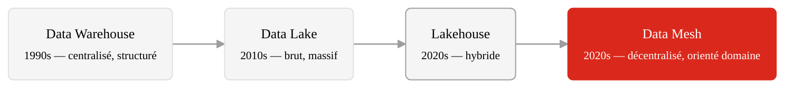
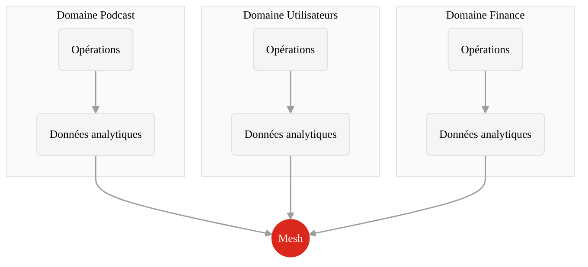
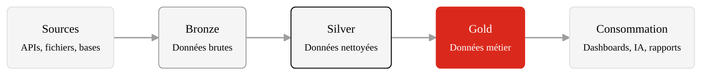
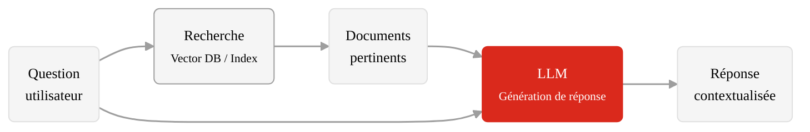
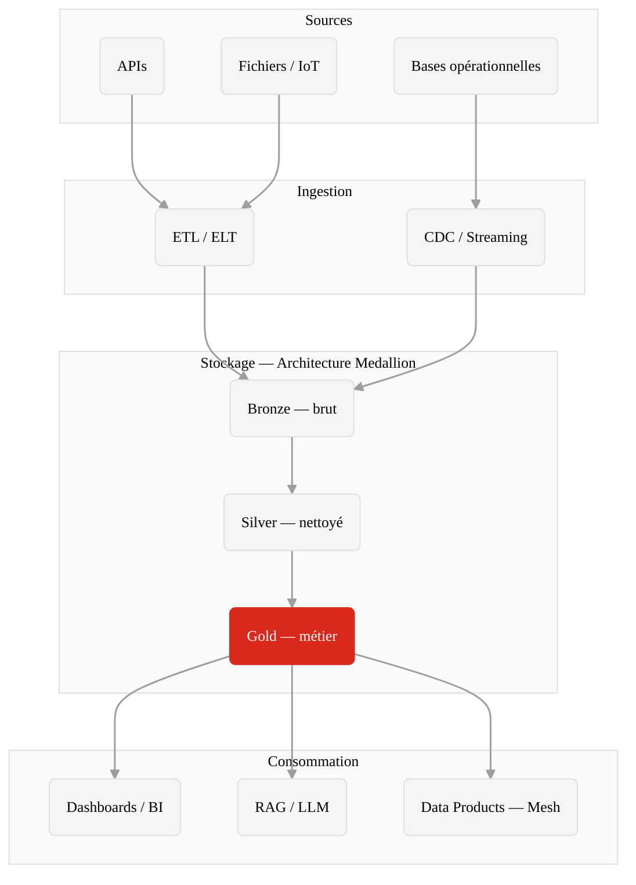

  
  

    <h1 class="cover-title">09 — Architectures modernes</h1>
    
Infrastructure de données

    

      Noemi Romano
      <a href="mailto:noemi.romano@heig-vd.ch" class="cover-email">noemi.romano@heig-vd.ch</a>
      {{ new Date().toLocaleDateString('fr-CH') }}
    

  

---
layout: section
---

# Du data warehouse au data mesh

L'évolution des architectures de données

---
layout: default
---

# Le problème des architectures centralisées

Pendant des décennies, les organisations ont centralisé leurs données dans un seul endroit.

<v-clicks>

- **Data warehouse** : toutes les données nettoyées dans un schéma unique, rigide, coûteux
- **Data lake** : toutes les données brutes dans un stockage massif — souvent devenu un _data swamp_
- **Équipe centrale** : une seule équipe responsable de toutes les données de l'organisation
- **ETL monolithique** : des pipelines fragiles qui cassent à chaque changement en amont

</v-clicks>

Résultat : des goulots d'étranglement, des données de mauvaise qualité, et une lenteur chronique à répondre aux besoins métier.

Source · Dehghani, <em>Data Mesh</em> (2022) · <a href="https://martinfowler.com/articles/data-mesh-principles.html">martinfowler.com — Data Mesh Principles</a>

---
layout: default
---

# L'évolution des architectures de données

### Approche centralisée

- Une équipe possède **toutes** les données
- Les domaines métier **consomment** passivement
- La qualité est vérifiée **en aval**
- Scalabilité limitée par l'équipe centrale

### Approche décentralisée (data mesh)

- Chaque domaine **possède** ses données
- Les domaines **produisent** des données de qualité
- La qualité est garantie **à la source**
- Scalabilité par l'autonomie des équipes

Source · <a href="https://martinfowler.com/articles/data-mesh-principles.html">Dehghani, <em>Data Mesh Principles and Logical Architecture</em></a>

---
layout: section
---

# Data Mesh

Les 4 principes fondateurs

---
layout: quote
---

# "We need to shift our thinking from data as a by-product of operational systems, to data as a first-class product."

Zhamak Dehghani, _Data Mesh_ (2022)

---
layout: default
---

# Principe 1 — Propriété orientée domaine

Chaque domaine métier est **responsable de ses propres données**.

<v-clicks>

- L'équipe **podcast** possède les données de podcasts
- L'équipe **utilisateurs** possède les données utilisateurs
- L'équipe **finance** possède les données financières
- Plus de dépendance à une équipe centrale de données

</v-clicks>

**Enjeu** : comment garantir la cohérence globale si chaque domaine gère ses données indépendamment ?

Source · <a href="https://martinfowler.com/articles/data-mesh-principles.html">martinfowler.com — Data Mesh Principles</a>

---
layout: default
---

# Principe 2 — La donnée comme produit

Les données ne sont plus un sous-produit des systèmes — elles sont un **produit à part entière**.

<v-clicks>

- **Découvrable** : les autres équipes peuvent trouver et comprendre les données
- **Compréhensible** : documentation, schéma, exemples d'utilisation
- **Fiable** : SLA, qualité mesurée, propriétaire identifié
- **Interopérable** : standards partagés, formats compatibles
- **Sécurisée** : contrôle d'accès, conformité RGPD

</v-clicks>

Comme un produit logiciel, un _data product_ a un **propriétaire**, des **utilisateurs**, et un **cycle de vie**. Si personne ne l'utilise, il n'a pas de valeur.

Source · Dehghani, <em>Data Mesh</em>, Ch. 6 — Data as a Product (2022)

---
layout: default
---

# Principe 3 — Infrastructure self-service

Chaque équipe doit pouvoir créer et publier ses données **sans dépendre d'une équipe centrale**.

### Provisionnement

Stockage, compute et accès provisionnés **automatiquement**

_L'équipe demande, la plateforme fournit._

### Expérience développeur

Outils, templates et abstractions pour **simplifier** la publication de data products

_Pas besoin d'être data engineer._

### Supervision du mesh

Découverte, observabilité et corrélation **transversale** entre domaines

_Le catalogue global._

**Enjeu** : démocratiser l'accès à l'infrastructure sans perdre le contrôle. Qui finance la plateforme ? Qui décide des standards techniques ?

Source · <a href="https://martinfowler.com/articles/data-mesh-principles.html">martinfowler.com — Data Mesh Principles</a>

---
layout: default
---

# Principe 4 — Gouvernance fédérée

Ni anarchie, ni dictature : une gouvernance **collaborative** et **automatisée**.

<v-clicks>

- **Décisions globales** : interopérabilité, identifiants partagés, standards de sécurité
- **Décisions locales** : modèle de données du domaine, choix de stockage, fréquence de mise à jour
- **Automatisation** : les politiques sont implémentées dans la plateforme, pas vérifiées manuellement

</v-clicks>

### Exemple concret

**Global** : tous les domaines utilisent le même identifiant utilisateur (`user_id UUID`)

**Local** : le domaine podcast choisit son propre schéma pour les épisodes

**Automatisé** : la plateforme vérifie la conformité à chaque publication

Source · Dehghani, <em>Data Mesh</em>, Ch. 15 — Federated Computational Governance (2022)

---
layout: section
---

# Data lakes, lakehouses et architecture Medallion

Les couches de l'infrastructure de données

---
layout: default
---

# Data lake : promesses et réalité

Un data lake stocke des données brutes de toutes natures dans un stockage distribué.

### La promesse

<v-clicks>

- Stocker **tout** sans se poser de questions
- Données structurées, semi-structurées, non structurées
- Analyses exploratoires sur données brutes
- Coût de stockage faible (object storage)

</v-clicks>

### La réalité

- **Data swamp** : données non documentées, inutilisables
- Pas de gouvernance — personne ne sait ce qui s'y trouve
- Pas de qualité — résultats non fiables
- Pas de catalogue — duplication massive

Le data lake sans gouvernance est un cimetière de données. L'architecture **Medallion** et le **data mesh** répondent à ce problème.

Source · <a href="https://www.databricks.com/glossary/data-lake">Databricks — What is a Data Lake?</a>

---
layout: default
---

# Architecture Medallion

Une organisation en couches de qualité croissante.

### Bronze

Données brutes, ingérées telles quelles. Historique complet. Aucune transformation.

_"Ce qu'on a reçu."_

### Silver

Données nettoyées, dédupliquées, typées. Jointures entre sources. Qualité vérifiée.

_"Ce qu'on a compris."_

### Gold

Données agrégées, prêtes pour l'analyse métier. KPIs, dimensions, métriques.

_"Ce qu'on peut utiliser."_

Source · <a href="https://www.databricks.com/glossary/medallion-architecture">Databricks — Medallion Architecture</a>

---
layout: default
---

# Lakehouse : le meilleur des deux mondes

Le **lakehouse** combine la flexibilité du data lake avec la fiabilité du data warehouse.

<v-clicks>

- Stockage ouvert (Parquet, Delta Lake, Iceberg) sur object storage
- Transactions ACID sur des fichiers distribués
- Schéma-on-read **et** schéma-on-write
- Un seul système pour l'analytique **et** l'IA

</v-clicks>

**Data warehouse**

Structuré, fiable, cher, rigide

**Lakehouse**

Structuré + flexible, ouvert, ACID, scalable

**Data lake**

Flexible, bon marché, chaotique, sans garanties

Source · <a href="https://www.cidrdb.org/cidr2021/papers/cidr2021_paper17.pdf">Armbrust et al., <em>Lakehouse: A New Generation of Open Platforms</em> (CIDR 2021)</a>

---
layout: section
---

# RAG et infrastructure de données internes

Quand l'infrastructure alimente l'intelligence artificielle

---
layout: default
---

# RAG : Retrieval-Augmented Generation

Le RAG connecte un modèle de langage (LLM) aux **données internes** de l'organisation.

<v-clicks>

- L'utilisateur pose une question en langage naturel
- Le système **cherche** les documents pertinents dans la base interne
- Le LLM **génère** une réponse en s'appuyant sur ces documents
- La réponse est **ancrée** dans les données réelles de l'organisation

</v-clicks>

Source · <a href="https://arxiv.org/abs/2005.11401">Lewis et al., <em>Retrieval-Augmented Generation for Knowledge-Intensive NLP Tasks</em> (2020)</a>

---
layout: default
---

# Pourquoi le RAG dépend de l'infrastructure

Un système RAG est aussi bon que les données qu'il interroge.

### Ce qu'il faut

<v-clicks>

- Des données **à jour** : si la base est obsolète, les réponses le seront aussi
- Des données **de qualité** : garbage in, garbage out — amplifié par le LLM
- Un **catalogue** : le système doit savoir quels documents existent et où
- Des **embeddings** : les documents transformés en vecteurs pour la recherche sémantique

</v-clicks>

### L'infrastructure nécessaire

- **Vector database** (Pinecone, Weaviate, pgvector)
- **Pipeline d'ingestion** pour indexer les documents
- **Pipeline de mise à jour** pour garder l'index frais
- **Contrôle d'accès** : le RAG ne doit pas révéler des données confidentielles

**Enjeu critique** : un RAG interne mal configuré peut exposer des données sensibles (salaires, évaluations, stratégie) à des personnes non autorisées.

Source · <a href="https://docs.llamaindex.ai/en/stable/">LlamaIndex Documentation</a> · <a href="https://python.langchain.com/docs/tutorials/rag/">LangChain — RAG Tutorial</a>

---
layout: default
---

# RAG interne : cas d'usage concrets

### Base de connaissances d'entreprise

Un employé demande : _"Quelle est notre politique de télétravail ?"_

Le RAG cherche dans les documents RH internes et génère une réponse synthétique avec les sources.

### Support client augmenté

Un agent pose : _"Ce client a-t-il droit à un remboursement ?"_

Le RAG consulte l'historique client, les conditions générales, et les exceptions négociées.

### Documentation technique

Un développeur demande : _"Comment déployer le service X en production ?"_

Le RAG parcourt les runbooks, les README et les post-mortems passés.

### Analyse réglementaire

Un juriste demande : _"Quels articles de la nLPD s'appliquent à ce traitement ?"_

Le RAG croise les textes de loi avec les registres de traitement internes.

Source · <a href="https://www.anthropic.com/news/contextual-retrieval">Anthropic — Contextual Retrieval</a>

---
layout: section
---

# Vue d'ensemble : l'infrastructure de données moderne

---
layout: default
---

# Comment tout s'articule

Source · Dehghani, <em>Data Mesh</em> (2022) · <a href="https://www.databricks.com/glossary/medallion-architecture">Databricks — Medallion Architecture</a>

---
layout: default
---

# Data mesh + Medallion + RAG : une synergie

### Data Mesh

Chaque domaine publie ses **data products** avec qualité et documentation.

_Qui produit les données ?_

### Medallion

Les données traversent des couches de qualité croissante (bronze → silver → gold).

_Comment les données mûrissent ?_

### RAG

Les données gold alimentent les systèmes d'IA internes via des embeddings et une recherche sémantique.

_Comment les données sont consommées ?_

<v-click>

Ces trois patterns répondent à des questions complémentaires et forment ensemble une **architecture de données moderne** :

</v-click>

Les domaines **produisent** (mesh), l'infrastructure **mûrit** (medallion), et l'IA **consomme** (RAG). Sans qualité en amont, pas d'intelligence en aval.

---
layout: section
---

# Enjeux critiques

---
layout: default
---

# Les questions que pose cette infrastructure

### Pouvoir et contrôle

<v-clicks>

- **Qui possède les données ?** Le domaine métier, la plateforme, le fournisseur cloud ?
- **Vendor lock-in** : les formats propriétaires enferment les organisations
- **Centralisation déguisée** : un data mesh mal implémenté recrée les silos qu'il devait supprimer
- **Accès au RAG** : qui peut poser des questions, et sur quelles données ?

</v-clicks>

### Coût et durabilité

- **Coût du stockage** : stocker "tout" n'est pas gratuit — le bronze s'accumule
- **Coût du compute** : les embeddings et la recherche vectorielle consomment massivement
- **Empreinte carbone** : chaque requête RAG implique un appel à un LLM
- **Travail invisible** : qui maintient les pipelines, les index, les embeddings ?

Source · Crawford, <em>Atlas of AI</em> (2021) · <a href="https://data-feminism.mitpress.mit.edu/">D'Ignazio & Klein, <em>Data Feminism</em></a>

---
layout: quote
---

# "Continuously failing ETL jobs and ever growing complexity of a labyrinth of data pipelines is a familiar pain for anyone who has worked in the data domain."

Zhamak Dehghani, _Data Mesh Principles_ (2020)

---
layout: default
---

# Récapitulatif

<v-clicks>

1. **Data warehouse → data lake → lakehouse → data mesh** : une évolution vers la décentralisation et la qualité
2. **Data mesh** : 4 principes — propriété domaine, données comme produit, self-service, gouvernance fédérée
3. **Architecture Medallion** : bronze (brut) → silver (nettoyé) → gold (métier)
4. **RAG** : connecter les LLM aux données internes — puissant mais dépendant de la qualité
5. **Infrastructure moderne** : mesh + medallion + RAG forment un système cohérent
6. **Enjeux critiques** : pouvoir, coût, durabilité, accès, travail invisible

</v-clicks>

---
layout: default
---

# Ressources

### Livres et articles

- **Data Mesh** — Dehghani (2022)
   <small>O'Reilly Media</small>

- **Designing Data-Intensive Applications** — Kleppmann (2017)
   <small>O'Reilly Media</small>

- [Data Mesh Principles](https://martinfowler.com/articles/data-mesh-principles.html) — martinfowler.com

### En ligne

- [Medallion Architecture](https://www.databricks.com/glossary/medallion-architecture) — Databricks
- [RAG Tutorial](https://python.langchain.com/docs/tutorials/rag/) — LangChain
- [Contextual Retrieval](https://www.anthropic.com/news/contextual-retrieval) — Anthropic
- [Lakehouse Paper (CIDR 2021)](https://www.cidrdb.org/cidr2021/papers/cidr2021_paper17.pdf)

Source · <a href="https://github.com/MediaComem/comem-infradon-1">github.com/MediaComem/comem-infradon-1</a>

---
layout: end
---

# Questions ?
