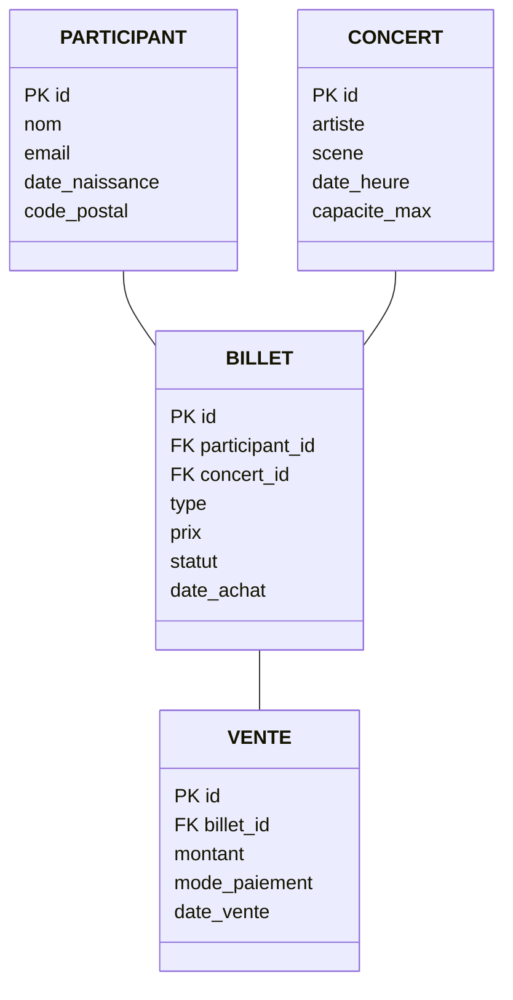

# Infrastructure de données (InfraDon)
## Examen type de préparation à l'examen final

> Cet examen type couvre l'ensemble de la matière du cours et suit le format de l'examen final. Il est mis à disposition à titre d'entraînement.

**Durée :** 2h, sur papier\
**Documents autorisés :** une feuille A4 recto-verso manuscrite

---

## Contexte

Un festival de musique estival accueille chaque été plusieurs dizaines de milliers de spectateur·rice·s sur 4 jours et 5 scènes. La billetterie, les données des participant·e·s et le programme des concerts sont gérés dans une base PostgreSQL.

```
participant (id, nom, email, date_naissance, code_postal)
concert     (id, artiste, scene, date_heure, capacite_max)
billet      (id, participant_id, concert_id, type, prix, statut, date_achat)
vente       (id, billet_id, montant, mode_paiement, date_vente)
```

**MLD :**



---

## Partie 1 | QCM (20 pts | 2 pts par question)

Une seule bonne réponse par question. Aucune justification requise.

---

**Q1.** Un·e participant·e achète un billet en ligne. Le paiement est débité mais le serveur tombe avant que le billet ne soit créé. Quelle propriété ACID garantit que ni le débit ni la création du billet ne sont conservés dans cet état partiel ?

- [ ] A) Durabilité
- [ ] B) Isolation
- [ ] C) Cohérence
- [ ] D) Atomicité

---

**Q2.** Deux personnes tentent simultanément d'acheter le dernier billet disponible pour un concert complet. Quelle anomalie de concurrence risque de se produire si la transaction n'est pas correctement protégée ?

- [ ] A) Dirty read
- [ ] B) Lost update
- [ ] C) Phantom read
- [ ] D) Non-repeatable read

---

**Q3.** La table `billet` contient 500 000 lignes. Les bénévoles au portail scannent les billets en cherchant `WHERE code_barre = $1`. Quel type d'index est le plus adapté pour cette recherche par égalité sur une valeur unique ?

- [ ] A) GIN
- [ ] B) GiST
- [ ] C) Hash
- [ ] D) B-Tree composite

---

**Q4.** On lance `EXPLAIN ANALYZE SELECT * FROM billet WHERE statut = 'valide'` et le résultat affiche `Rows Removed by Filter: 487 312`. Que cela indique-t-il ?

- [ ] A) 487 312 billets valides ont été retournés
- [ ] B) 487 312 lignes ont été lues et rejetées : un index sur `statut` pourrait aider
- [ ] C) La requête a échoué sur 487 312 lignes
- [ ] D) L'index a parcouru 487 312 noeuds de l'arbre B-Tree

---

**Q5.** Le rôle `benevole` doit pouvoir lire les billets et mettre à jour leur statut (ex : `'valide'` -> `'utilise'`), mais ne doit pas pouvoir supprimer des billets ni accéder aux données de paiement. Quelle commande est correcte ?

- [ ] A) `GRANT ALL ON billet TO benevole;`
- [ ] B) `GRANT SELECT, UPDATE ON billet TO benevole;`
- [ ] C) `GRANT SELECT ON billet TO benevole; GRANT UPDATE (statut) ON billet TO benevole;`
- [ ] D) `GRANT READ, WRITE ON billet TO benevole;`

---

**Q6.** L'organisation reçoit chaque année les données de billetterie des années précédentes depuis un prestataire externe sous forme de fichiers CSV, les charge dans PostgreSQL, puis les nettoie et les agrège pour produire des rapports de fréquentation. Quel pattern cela décrit-il ?

- [ ] A) ETL
- [ ] B) ELT
- [ ] C) OLTP
- [ ] D) CAP

---

**Q7.** Les 500 bénévoles au portail scannent des QR codes. Chaque scan déclenche une vérification du statut du billet. Pour éviter de requêter la base à chaque scan, on souhaite maintenir un cache en mémoire, accessible en moins d'une milliseconde. Quelle structure de données est la plus adaptée ?

- [ ] A) Document (MongoDB)
- [ ] B) Clé-valeur (Redis)
- [ ] C) Graphe (Neo4j)
- [ ] D) Colonnes larges (Cassandra)

---

**Q8.** La colonne `statut` dans la table de staging contient des valeurs comme `'valide'`, `'  '` (espaces seulement) et `NULL`. Quelle expression renvoie `NULL` dans les deux derniers cas ?

- [ ] A) `TRIM(statut)`
- [ ] B) `COALESCE(statut, 'inconnu')`
- [ ] C) `NULLIF(TRIM(statut), '')`
- [ ] D) `LOWER(statut)`

---

**Q9.** L'organisation souhaite envoyer des recommandations personnalisées de concerts basées sur les historiques d'achat de chaque participant·e. Quelle structure de données NoSQL serait la plus pertinente pour modéliser les relations entre participant·e·s et concerts (« les gens qui ont aimé X ont aussi aimé Y ») ?

- [ ] A) Clé-valeur (Redis)
- [ ] B) Colonnes larges (Cassandra)
- [ ] C) Graphe (Neo4j)
- [ ] D) Document (MongoDB)

---

**Q10.** La nLPD suisse s'applique-t-elle aux données des participant·e·s du festival (noms, emails, dates de naissance) ?

- [ ] A) Non, la nLPD ne s'applique qu'aux administrations fédérales
- [ ] B) Oui, dès lors que des personnes physiques sont concernées
- [ ] C) Non, car le festival est un événement privé
- [ ] D) Oui, mais uniquement si le festival a plus de 250 employés

---

## Partie 2 | SQL (36 pts | 2 pts par affirmation)

Pour chaque affirmation, indiquez si elle est **vraie** ou **fausse**. Si elle est fausse, justifiez brièvement.

---

### Question 2.1 | Import et nettoyage

Les données de billetterie 2023 sont importées depuis un fichier CSV fourni par le prestataire externe.

```sql
CREATE SCHEMA IF NOT EXISTS staging;

CREATE TABLE staging.billets_2023 (
  id           TEXT,
  participant  TEXT,
  concert      TEXT,
  type         TEXT,
  prix         TEXT,
  statut       TEXT,
  date_achat   TEXT
);

INSERT INTO billet (id, participant_id, concert_id, type, prix, statut, date_achat)
SELECT
  id::INT,
  p.id,
  c.id,
  CASE LOWER(TRIM(type))
    WHEN 'jour'       THEN 'jour'
    WHEN 'pass 4j'    THEN 'pass_4j'
    WHEN 'pass 4 j'   THEN 'pass_4j'
    WHEN 'vip'        THEN 'vip'
    ELSE NULL
  END,
  REGEXP_REPLACE(prix, '[^0-9.]', '', 'g')::NUMERIC,
  LOWER(TRIM(statut)),
  TO_DATE(date_achat, 'DD.MM.YYYY')
FROM staging.billets_2023 s
JOIN participant p ON LOWER(TRIM(p.email)) = LOWER(TRIM(s.participant))
JOIN concert     c ON TRIM(c.artiste)      = TRIM(s.concert)
WHERE NULLIF(TRIM(s.prix), '') IS NOT NULL;
```

**Q1.** La table `staging.billets_2023` refusera d'importer une ligne dont `prix = 'CHF 45.-'` à cause de la contrainte de type.

- [ ] Vrai
- [ ] Faux

Justification si faux : _______________________________________________

---

**Q2.** Après l'INSERT, un billet dont `type = 'early bird'` dans la staging aura `NULL` dans la colonne `type` de la table `billet`.

- [ ] Vrai
- [ ] Faux

Justification si faux : _______________________________________________

---

**Q3.** `REGEXP_REPLACE(prix, '[^0-9.]', '', 'g')::NUMERIC` transforme `'CHF 45.-'` en `45` (type NUMERIC).

- [ ] Vrai
- [ ] Faux

Justification si faux : _______________________________________________

---

**Q4.** Les billets dont le participant ou le concert ne peut pas être retrouvé en base seront quand même insérés, avec `participant_id = NULL` et `concert_id = NULL`.

- [ ] Vrai
- [ ] Faux

Justification si faux : _______________________________________________

---

**Q5.** Un billet dont le `prix` est `NULL` dans la staging est exclu de l'INSERT.

- [ ] Vrai
- [ ] Faux

Justification si faux : _______________________________________________

---

### Question 2.2 | Transactions et isolation

Deux acheteurs tentent simultanément de réserver le dernier billet d'un concert (capacite_max = 500).

```sql
-- T1 et T2 démarrent en READ COMMITTED (défaut)

-- T1
BEGIN;
SELECT COUNT(*) FROM billet
  WHERE concert_id = 12 AND statut != 'annule';
-- Résultat : 499  (1 place restante)

-- (T2 exécute et commite en parallèle :
--   INSERT INTO billet (concert_id, statut, ...) VALUES (12, 'valide', ...); COMMIT; )

-- T1 insère à son tour
INSERT INTO billet (concert_id, participant_id, statut, ...)
  VALUES (12, 77, 'valide', ...);
COMMIT;
```

**Q6.** En `READ COMMITTED`, le `COUNT(*)` de T1 voit le billet inséré par T2 si T2 a commité avant que T1 n'exécute son `SELECT`.

- [ ] Vrai
- [ ] Faux

Justification si faux : _______________________________________________

---

**Q7.** Dans le scénario ci-dessus, T1 peut insérer son billet même si T2 a déjà amené le concert à 500 billets, car aucun mécanisme ne vérifie la capacite_max pendant la transaction.

- [ ] Vrai
- [ ] Faux

Justification si faux : _______________________________________________

---

**Q8.** Pour éviter ce problème, il suffit de remplacer `READ COMMITTED` par `SERIALIZABLE` : PostgreSQL refusera automatiquement l'insertion qui dépasse la capacite_max.

- [ ] Vrai
- [ ] Faux

Justification si faux : _______________________________________________

---

**Q9.** `SELECT ... FOR UPDATE SKIP LOCKED` permettrait à plusieurs bénévoles de traiter des billets en attente de validation en parallèle, sans se bloquer mutuellement.

- [ ] Vrai
- [ ] Faux

Justification si faux : _______________________________________________

---

### Question 2.3 | Rôles et permissions

```sql
CREATE ROLE participant_web;
CREATE ROLE benevole;
CREATE ROLE organisateur;

GRANT SELECT ON concert     TO participant_web;
GRANT SELECT ON billet      TO participant_web;

GRANT SELECT                  ON billet TO benevole;
GRANT UPDATE (statut)         ON billet TO benevole;
GRANT SELECT                  ON concert TO benevole;

GRANT ALL PRIVILEGES ON billet      TO organisateur;
GRANT ALL PRIVILEGES ON participant TO organisateur;
GRANT ALL PRIVILEGES ON vente       TO organisateur;

CREATE USER lea WITH PASSWORD 'pwd1';
CREATE USER sam WITH PASSWORD 'pwd2';

GRANT participant_web TO lea;
GRANT benevole        TO sam;
GRANT organisateur    TO sam;
```

**Q10.** Lea peut consulter la liste des concerts disponibles.

- [ ] Vrai
- [ ] Faux

Justification si faux : _______________________________________________

---

**Q11.** Sam peut modifier le nom d'un artiste dans la table `concert`.

- [ ] Vrai
- [ ] Faux

Justification si faux : _______________________________________________

---

**Q12.** Lea peut annuler (mettre à jour le statut de) son propre billet.

- [ ] Vrai
- [ ] Faux

Justification si faux : _______________________________________________

---

**Q13.** Sam peut supprimer des lignes dans la table `vente`.

- [ ] Vrai
- [ ] Faux

Justification si faux : _______________________________________________

---

**Q14.** Pour retirer au rôle `benevole` le droit de lire la table `billet`, la commande est :

```sql
REVOKE SELECT ON billet FROM benevole;
```

- [ ] Vrai
- [ ] Faux

Justification si faux : _______________________________________________

---

### Question 2.4 | Index et optimisation

```sql
-- Table billet (~500 000 lignes)

-- Requête 1 : sans index
EXPLAIN ANALYZE
  SELECT * FROM billet WHERE concert_id = 42;

-- Seq Scan on billet  (cost=0.00..12400.00 rows=1820 width=64)
--   Filter: (concert_id = 42)
--   Rows Removed by Filter: 498180
--   Execution Time: 95.210 ms

CREATE INDEX idx_billet_concert ON billet(concert_id);

-- Requête 1 : avec index
EXPLAIN ANALYZE
  SELECT * FROM billet WHERE concert_id = 42;

-- Index Scan using idx_billet_concert on billet
--   Index Cond: (concert_id = 42)
--   Execution Time: 1.340 ms

-- Requête 2 : recherche par email (colonne non indexée)
EXPLAIN ANALYZE
  SELECT b.* FROM billet b
  JOIN participant p ON p.id = b.participant_id
  WHERE LOWER(p.email) = 'alice@example.com';
-- Seq Scan on participant ...
--   Execution Time: 45.820 ms
```

**Q15.** Avant la création de l'index, PostgreSQL a lu environ 500 000 lignes pour répondre à la requête sur `concert_id = 42`.

- [ ] Vrai
- [ ] Faux

Justification si faux : _______________________________________________

---

**Q16.** L'index `idx_billet_concert` a réduit le temps d'exécution d'un facteur d'environ 70.

- [ ] Vrai
- [ ] Faux

Justification si faux : _______________________________________________

---

**Q17.** D'après le résultat de l'`EXPLAIN ANALYZE`, la création de l'index `idx_billet_concert` a également accéléré la recherche par email (`WHERE LOWER(p.email) = 'alice@example.com'`).

- [ ] Vrai
- [ ] Faux

Justification si faux : _______________________________________________

---

**Q18.** Créer un index sur chaque colonne de la table `billet` est une bonne pratique pour maximiser les performances en lecture.

- [ ] Vrai
- [ ] Faux

Justification si faux : _______________________________________________

---

## Partie 3 | Transactions et architectures (24 pts)

### Question 3.1 | Concurrence et transactions (8 pts)

**a)** Complétez le tableau suivant en indiquant si chaque niveau d'isolation PostgreSQL empêche chaque anomalie. (4 pts)

| Niveau | Dirty read | Non-repeatable read | Phantom read |
|---|:---:|:---:|:---:|
| READ COMMITTED | | | |
| REPEATABLE READ | | | |
| SERIALIZABLE | | | |

**b)** Le système de billetterie applique la règle suivante : si un concert est complet (`COUNT(billets valides) >= capacite_max`), l'achat est refusé. Voici la transaction :

```sql
BEGIN;
SELECT COUNT(*) FROM billet
  WHERE concert_id = $1 AND statut != 'annule';
-- Si count < capacite_max :
INSERT INTO billet (concert_id, participant_id, statut, prix)
  VALUES ($1, $2, 'valide', $3);
COMMIT;
```

Expliquez le problème de concurrence qui peut amener deux acheteurs à acheter le même billet en trop. Proposez une solution SQL concrète. (4 pts)

---

### Question 3.2 | Architecture et structures de données (8 pts)

**a)** Le festival souhaite mettre en place un pipeline ELT pour centraliser chaque année les données de billetterie, de fréquentation et de revenus, afin de produire des tableaux de bord décisionnels pour la prochaine édition. Décrivez les trois étapes de ce pipeline dans le contexte du festival, avec un exemple concret pour chacune. (3 pts)

**b)** Chaque soir, la·le responsable de billetterie lance un rapport SQL qui calcule le chiffre d'affaires total, le taux de remplissage par concert et les revenus par type de billet. Ce rapport scanne l'intégralité de la table `billet` (500 000 lignes) et prend 2 minutes. Pendant ce temps, des acheteur·se·s signalent des lenteurs lors de l'achat en ligne. Expliquez pourquoi ce conflit survient et proposez deux solutions architecturales vues en cours. (3 pts)

**c)** Le festival envisage de passer d'une architecture centralisée (une équipe data gère tout) à une organisation où chaque domaine (billetterie, programmation, restauration) gère ses propres données. Quel concept vu en cours correspond à cette approche ? Citez deux de ses principes fondamentaux. (2 pts)

---

### Question 3.3 | Sauvegarde et restauration (8 pts)

**a)** La base de billetterie doit être sauvegardée chaque soir pendant les 4 jours du festival. Proposez une commande `pg_dump` adaptée et justifiez le format choisi. (2 pts)

**b)** Le matin du Jour 2, un `DELETE FROM billet WHERE statut = 'annule'` est exécuté par erreur sans clause `WHERE` suffisamment précise, supprimant 12 000 billets valides. Décrivez les étapes pour restaurer uniquement la table `billet` depuis la sauvegarde de la veille, sans toucher au reste de la base. (3 pts)

**c)** L'équipe technique propose d'utiliser le **soft delete** (champ `deleted_at`) plutôt que le hard delete pour les billets annulés. Quels sont les avantages de cette approche pour le festival ? Quelle contrainte légale peut entrer en tension avec ce choix ? (3 pts)

---

## Partie 4 | Éthique et gouvernance des données (20 pts)

### Question 4.1 | Identifier les problèmes (12 pts)

Pour chacun des cas suivants, identifiez le problème et proposez une correction ou une recommandation :

**a)** Le festival utilise un algorithme pour recommander des concerts aux participant·e·s dans l'application mobile. L'algorithme est entraîné uniquement sur l'historique des achats passés. On constate qu'il ne recommande jamais de concerts de musiques du monde ni de jazz, car ces genres génèrent peu de clics dans les données historiques. Ces artistes vendent donc encore moins de billets à l'édition suivante. (3 pts)

**b)** La base de données des participant·e·s (noms, emails, codes postaux, historiques d'achat) est hébergée chez un prestataire américain sur des serveurs situés en Irlande. Le·la directeur·rice technique affirme que c'est conforme à la nLPD car les serveurs sont en Europe. (3 pts)

**c)** A la fin du festival, l'organisation conserve l'intégralité des données de tous les participant·e·s (y compris les coordonnées et historiques d'achat) pour les 15 prochaines années, au cas où elle aurait besoin de les recontacter pour de futures éditions. (3 pts)

**d)** Pour améliorer la sécurité aux entrées, l'organisation envisage d'utiliser la reconnaissance faciale pour valider les billets, en comparant la photo prise à l'entrée avec celle du profil du compte participant·e. (3 pts)

---

### Question 4.2 | RGPD, nLPD et gouvernance (8 pts)

**a)** Classez les données suivantes en deux colonnes : données personnelles / données non personnelles. (2 pts)

- Email du participant
- Nombre total de billets vendus pour un concert
- Code postal du participant
- Nom de l'artiste
- Historique des achats lié à un compte participant
- Capacité maximale d'une scène

**b)** Le festival souhaite partager les données de fréquentation (nombre de visiteurs par jour, par scène, par tranche d'âge) avec des partenaires médias pour la promotion de la prochaine édition. Quelles précautions doit-il prendre avant de partager ces données ? Citez deux mesures concrètes. (3 pts)

**c)** Après le festival, l'organisation envoie à tou·te·s ses participant·e·s passé·e·s une newsletter hebdomadaire sur la programmation de la prochaine édition, sans leur avoir demandé leur accord lors de l'inscription. Identifiez le problème et citez le principe de protection des données qui est violé. (3 pts)
